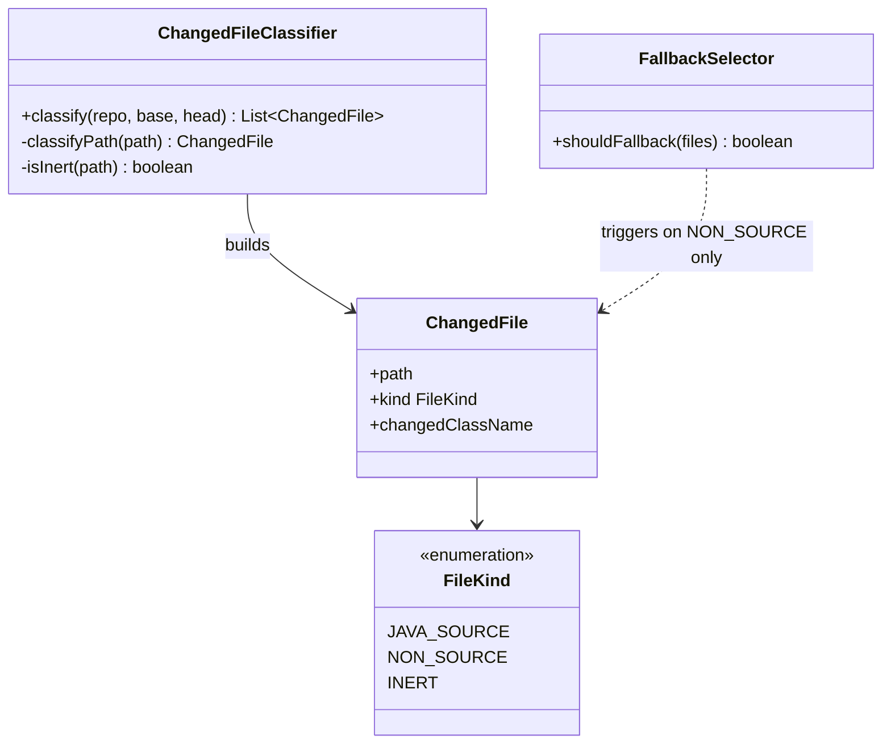
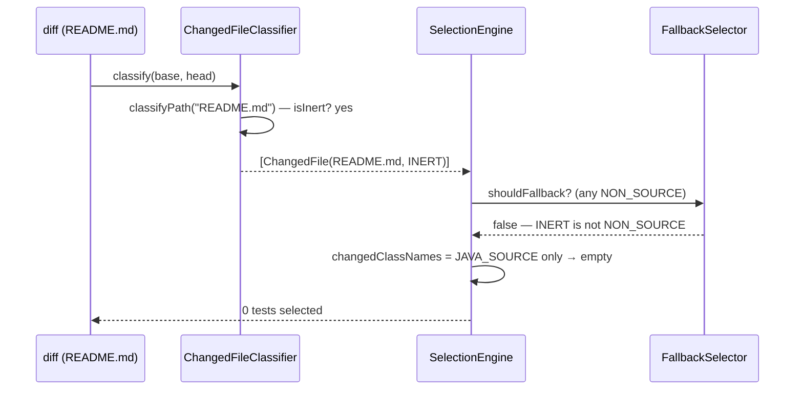

# Design: inert-file classification

started: 2026-07-11

Add a third `FileKind.INERT` for changed files that provably cannot affect any test outcome
(docs, LICENSE, images). The elegance: **INERT needs no change to the selection logic.** The
fallback triggers only on `NON_SOURCE`, and dependency-matching contributes only from
`JAVA_SOURCE`. An `INERT` file is neither — so it triggers no fallback and matches no test,
and a change that is only inert selects **zero** tests, for free.

## Class diagram

## Sequence: a README-only change selects zero tests

## Constitution check (`.specify/memory/constitution.md`, via the `.fluencyloop` pointer)

- **§III (Sound by default):** the allowlist MUST be conservative — only paths that *provably*
  cannot affect a test outcome. A false "inert" call skips tests that should run.
- **§IV (Deterministic core):** a fixed path allowlist, not a probabilistic guess. ✓
- **§V (Explainability):** the surfaced reason for an inert file is "matched no executable
  scope (inert path)", not an opaque score. ✓

## Allowlist scope (resolved)

An allowlist, never a blocklist: anything not provably inert stays `NON_SOURCE` (fallback),
so INERT only ever *narrows* to zero for provably-safe paths. **Anything under
`**/resources/**` is excluded** — a Markdown/YAML/image there could be test data a test
loads, and dependency tracking (class loads only) can't see it, so it must fall back.

INERT (and not under `**/resources/**`) when the path matches:

- **Docs:** `*.md`, `*.markdown`, `*.adoc`, `*.rst`; and `README*`, `LICENSE*`, `NOTICE*`,
  `AUTHORS*`, `CHANGELOG*`, `CONTRIBUTING*`, `CODE_OF_CONDUCT*`, `SECURITY*`; `docs/**`
- **Media:** `*.png`, `*.jpg`, `*.jpeg`, `*.gif`, `*.svg`, `*.ico`, `*.webp`
- **VCS/editor/CI/IDE metadata:** `.gitignore`, `.gitattributes`, `.mailmap`, `.editorconfig`,
  `.github/**`, `.idea/**`, `.vscode/**`, `*.iml`

**Hard boundary — these stay `NON_SOURCE` (can affect a test outcome):** `pom.xml`,
`*.properties`, non-`.github` `*.yml`/`*.yaml`, `*.sql`, `.mvn/**`, `mvnw`, and everything
under `**/resources/**`.
