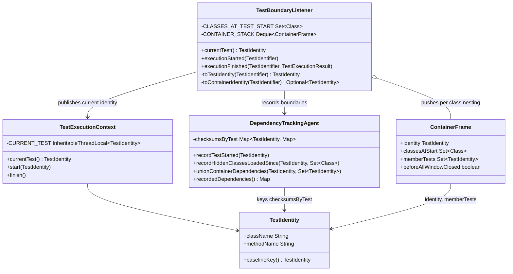
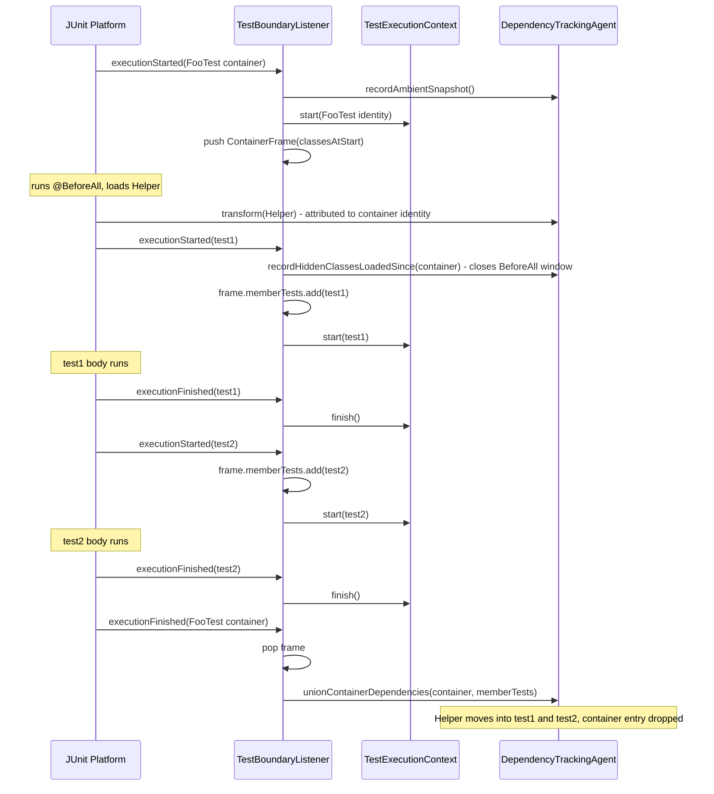

# Design: core: attribute @BeforeAll-loaded classes to their container's tests

started: 2026-08-05
branch: feature/219-core-attribute-beforeall-loaded-classes-to-their-contain
relates to: #41 (the coverage-gap warning this closes), gh #219

## Problem

`TestBoundaryListener` only publishes a `currentTest()` identity while a JUnit 5 **test method**
is running (`executionStarted`/`executionFinished` guarded by `testIdentifier.isTest()`). A class
loaded only inside `@BeforeAll` runs while no test is current, so `DependencyTrackingAgent` either
drops the load entirely or folds it into the fork-wide ambient set — invisible to any specific
test's attribution. README's Known limitations documents this; #41 only warns about it. This
closes it: attribute the load, instead of just flagging it.

## Class diagram

The only new type is `ContainerFrame`, a private record `TestBoundaryListener` stacks per class
nesting level (so `@Nested` classes fall out for free). `TestIdentity` already reserves a
`null` method name as a "class-level identity" per its own Javadoc — reused here as the
synthetic container identity, not invented.

## Sequence: one class, two tests, a @BeforeAll dependency

The named-class path needs no `DependencyTrackingAgent.transform()` change: it already attributes
every load to whatever `currentTest()` returns, and now that can be the container identity while
`@BeforeAll` runs. Only the hidden-class window-close and the final union are new agent surface
(`unionContainerDependencies`), and `recordHiddenClassesLoadedSince` is reused as-is.

## Decisions

- **Close the @BeforeAll hidden-class window at the first child test, not at container finish.**
  The named-class map for the container key naturally spans only `@BeforeAll` (`currentTest()`
  moves to the first test the moment it starts). The hidden-class diff has no such natural
  boundary — closing it at container finish instead would span the whole class, including every
  test body, leaking test-only hidden/lambda classes into sibling tests. Safe (extra deps only
  widen re-runs, never hide one needed) but noisy; closing it early keeps the container's window
  precisely `@BeforeAll`-shaped.
- **Stack container frames instead of one field.** `@Nested` classes fire their own container
  start/finish nested inside the outer one; a stack makes a test join its *immediate* container's
  `memberTests` for free. Not handled: an outer class's own `@BeforeAll` dependencies do not
  propagate down to a `@Nested` class's tests — out of this issue's scope, same shape as the
  existing `@AfterAll` gap (untouched by this feature).
- **Scoped to `@BeforeAll` only, `@AfterAll` stays open — confirmed with the developer.**
  `TestExecutionListener` gives no hook between "last child test finished" and
  `executionFinished(container)` (which fires after `@AfterAll` runs), so closing `@AfterAll` too
  would mean re-arming `currentTest = container` after *every* test finishes rather than only
  before the first — making the container a standing/background identity for the whole class.
  That also sweeps up inter-test `@BeforeEach`/`@AfterEach` gaps and unions them into *every*
  sibling test at container finish, not just the adjacent one: safe (over-attribution, never
  under-), but coarser than this feature's `@BeforeAll`-only precision. Deliberately left as a
  documented, separate gap rather than folded in — tracked as #221.
