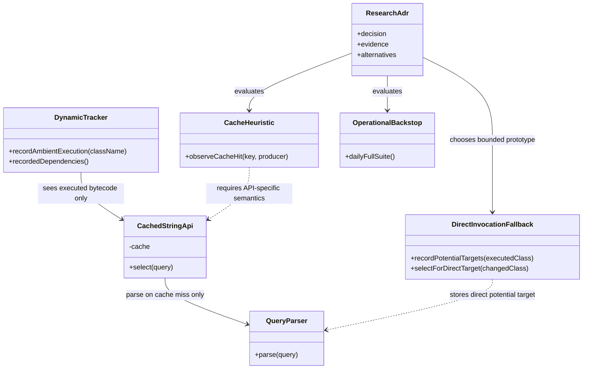
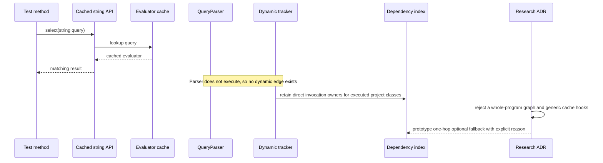

# Design: decide whether to mitigate string-dispatched cached dependency blind spots

started: 2026-08-05
branch: feature/220-decide-whether-to-mitigate-string-dispatched-cached-depe
relates to: #220, #41

## Problem

The tracker records a dependency only when an instrumented class executes while a test identity
is current. Its callbacks already cover method entry, field access, type references, and class
literals. A string-dispatched API with a cached parse result can bypass all of them: a test calls
`select("div > p")`, receives a cached evaluator, and never executes `QueryParser` even though a
change to that parser can alter the test result.

The jsoup historical replay measured this as 745 skipped killing tests for four `QueryParser`
mutants. The selection rule behaved as designed; the missing edge is not present in the dynamic
record. This feature decides whether a generic mitigation is justified, rather than silently
adding a broad and potentially noisy analysis layer.

## Class diagram

## Sequence: cached call and research decision

## Research shape

- **Whole-program static or hybrid call graph:** Build a per-test method reachability graph and
  select a test when a changed class is reachable from it, even without execution. SootUp's
  documented call graph algorithms require a complete type hierarchy and explicit entry methods,
  while dynamic dispatch, reflection, generated code, and string-to-parser routing still need
  modelling. A sufficiently safe graph risks selecting much of the suite and introduces a large
  analysis dependency into the hot selection path.
- **Bounded direct-invocation fallback:** Retain the direct invocation-owner references visible in
  the bytecode of a project class only after a test dynamically demonstrated that the class ran.
  If a changed project class is one of those direct potential targets, select that test with a
  reason naming both classes. This single-hop, class-level rule can over-attribute a skipped
  branch to the test, but it does not need to understand a cache's key or invalidation semantics.
- **Targeted cache instrumentation:** Observe a cache hit and attribute the cache producer class
  to the current test. This can be precise for one known library only if the cache key, producer,
  invalidation rules, wrappers, and concurrency semantics are modelled. A generic `Map` hook cannot
  recover those semantics and would create unbounded false edges.
- **Operational backstop:** Keep the documented string-DSL limitation and rely on the existing
  daily full-suite recommendation. This preserves the deterministic dynamic core and requires no
  new dependency, but retains the measured jsoup exposure until a narrow, evidence-backed optional
  adapter earns its own feature.

## Decision

Record the research decision in `research.md` and pursue an **optional, bounded
direct-invocation-reference prototype** in [#225](https://github.com/baokhang83/blastradius/issues/225).
The prototype is deliberately narrower than a whole-program call graph: it starts from a class
the test demonstrably executed, follows only its declared direct invocation owners, and stops.
It is class-level conservative, so a method branch that did not run can still cause an extra test
to be selected. That is acceptable only while measurement confirms the fallback recovers the
jsoup `QueryParser` misses without an impractical selection expansion.

Reject a mandatory whole-program graph and generic cache instrumentation for this feature. The
former needs broad classpath and entry-point modelling, while the latter cannot generically infer
cache producer, key, invalidation, wrapper, or concurrency semantics. The existing daily full
suite remains the operational backstop while the optional prototype is evaluated.

## Decision criteria for #225

1. A mitigation must either retain an explainable concrete reason for each extra test or remain
   opt-in for a named API family.
2. It must improve the measured jsoup `QueryParser` case without turning unrelated Java projects
   into near-full-suite runs.
3. It must not make static inference the mandatory core, because the project constitution requires
   dynamic tracking as the primary mechanism for reflective and runtime-generated edges.

## Constitution check

- **II. Simplicity:** do not embed a general program-analysis framework without a second concrete
  use case and a measured selection benefit.
- **III. Safety over speed:** a possible dependency may justify more tests, but the evidence must
  show the fallback improves rather than merely globalizes selection.
- **IV. Deterministic core before ML:** any result remains deterministic and explainable; no
  statistical prediction is in scope.
- **V. Explainability:** cache or reachability fallback would need to report the named rule and
  changed class, never an opaque confidence score.
