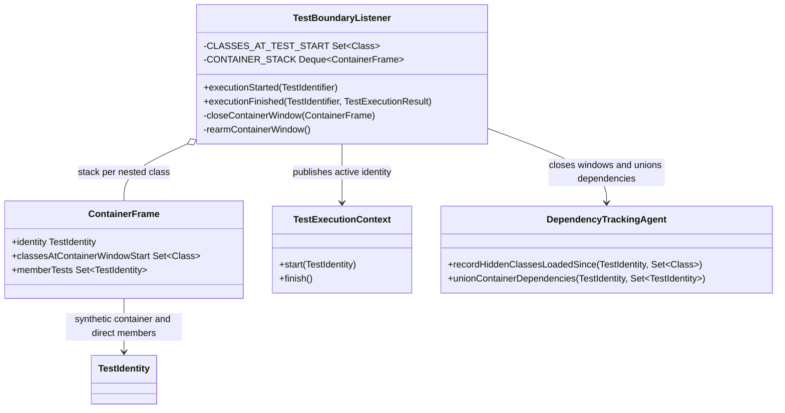
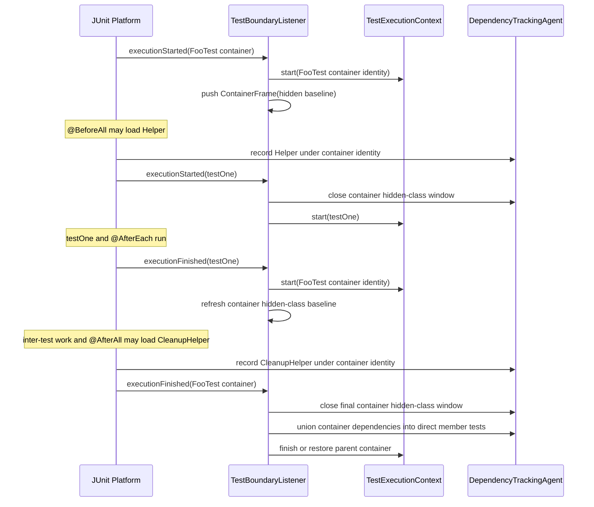

# Design: attribute @AfterAll and inter-test lifecycle dependencies to test containers

started: 2026-08-05
branch: feature/221-attribute-afterall-and-inter-test-lifecycle-dependencies
relates to: #219, #41, gh #221

## Problem

After #219, a class container owns a synthetic `TestIdentity` while `@BeforeAll` runs and
unions that dependency bucket into its member tests when the container finishes. The listener
clears the identity when every test finishes, however, so a project class used only after that
point - especially in `@AfterAll` - has no owner. The JUnit Platform has no distinct lifecycle
event for "the last child finished, cleanup is about to begin".

The conservative solution is to re-arm the innermost container immediately after every test
finishes. The container then owns ordinary class loads until the next test starts or the
container ends. JUnit's ordinary `@BeforeEach` and `@AfterEach` callbacks remain inside their
own test execution window and keep their precise method identity; only unowned work between
those windows and class cleanup is unioned to every direct member. It expands selection but
cannot hide a test that needs to run, satisfying constitution Principle III.

## Class diagram

`ContainerFrame` retains one mutable hidden-class baseline. Closing a container window records
hidden classes since that baseline and refreshes it. Re-arming after a test sets a new baseline
and publishes the container identity. A nested container first closes its parent's active window,
then restores the parent with a fresh baseline after the nested container finishes.

## Sequence: class lifecycle with cleanup dependency

## Decision

- **Accept conservative class-wide attribution after every test.** Re-arming the container after
  `executionFinished(test)` is the only listener-level point before a later `@AfterAll` load.
  The existing final union gives an otherwise unowned dependency to every direct member. A
  listener regression confirms standard `@BeforeEach` and `@AfterEach` callbacks stay under their
  own test identity, while work outside those test windows is deliberately conservative. The
  selected approach is deterministic, compact, and safe: it can run extra tests but cannot
  suppress a failure.
- **Track hidden classes over each container window, not only the first `@BeforeAll` window.**
  Named project classes are recorded immediately through the active identity, but hidden classes
  are visible only as a before/after loaded-class diff. Reusing one mutable window baseline
  captures `@AfterAll` and inter-test hidden classes without leaking test-body hidden classes into
  siblings.
- **Treat nested containers as suspended parent windows.** Before pushing an inner container,
  flush the parent window; after popping the inner frame, restore the parent identity and reset
  its hidden-class baseline. This prevents an outer class from absorbing nested test bodies while
  still allowing its lifecycle cleanup to be attributed safely.

## Constitution check

- **I. Test-driven development:** write listener and real-agent regression tests before the
  production change, including `@AfterAll` and hidden-class coverage.
- **II. Simplicity:** extend `ContainerFrame` and listener boundaries directly; no new lifecycle
  coordinator is needed.
- **III. Safety over speed:** class-wide attribution is intentionally conservative and never
  narrows selection.
- **V. Explainability:** selection reasons remain dependency matches; this changes only how a
  dependency enters an existing, inspectable baseline.
