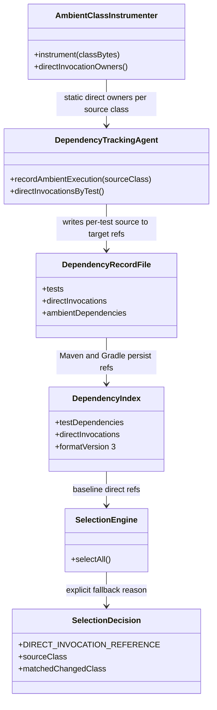
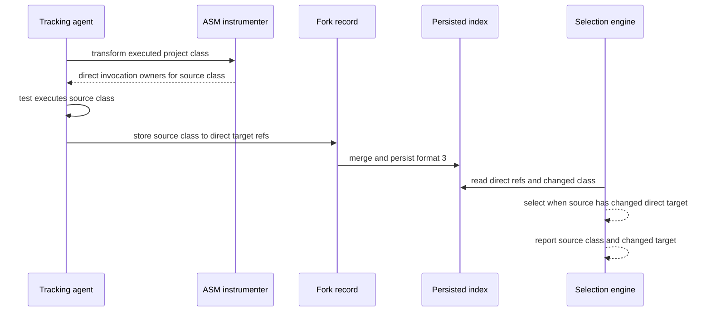

# Design: prototype direct invocation-reference fallback for cached dependencies

started: 2026-08-05
branch: feature/225-prototype-direct-invocation-reference-fallback-for-cache

## Scope

The prototype covers the shared tracking protocol and both Maven and Gradle index formats. It
does not add a transitive call graph or a generic cache hook. The one-hop fallback is enabled by
default for fresh format-3 indexes. Older indexes
remain ineligible after the format bump and therefore use the existing full-suite fallback.

## Class diagram

## Sequence: track, persist, and select a cached dependency

## Design decisions

- **Collect static references at transform time, attribute only at runtime:** ASM records each
  project class's declared direct method-invocation owners once while transforming it. The agent
  adds those references to a test only when that source class actually executes under the test's
  current identity. This retains the dynamic tracker as the gate and avoids per-invocation hooks.
- **Persist source and target, not only target:** a `test → source class → direct target classes`
  shape lets selection explain why it over-selected a test. Flattening to target classes would
  lose the executed source that made the fallback trustworthy enough to audit.
- **Separate format safety from the default selection policy:** format 3 carries the metadata and
  rejects older indexes safely. Fresh indexes enable the one-hop rule by default; Maven and Gradle
  each retain an explicit `false` setting for baseline comparisons and emergency rollback.
- **Keep one-hop precedence below ordinary dependency matching:** direct dynamic matches retain
  their existing reason. The fallback runs only when no direct dependency intersects the changed
  class, after broad fallback and new-or-modified-test rules have kept their current precedence.

## Acceptance checks

1. Unit tests prove a direct owner is recorded for an executed project class and never attributed
   merely because the class was transformed.
2. Core selection tests show that a changed direct target selects only the matching test with both
   source and target in its reason.
3. Maven and Gradle index round trips preserve the metadata and reject pre-format-3 indexes.
4. The jsoup `QueryParser` replay reports recovered killing tests and selection expansion under
   the default policy.

## Constitution check

- **I. Test-driven development:** add failing tracker, selection, and index compatibility tests
  before each implementation slice.
- **II. Simplicity:** retain a single-hop data shape and avoid a general call graph abstraction.
- **III. Safety over speed:** the rule can only select extra tests, and an unreadable index stays
  on the existing full-suite fallback path.
- **IV. Deterministic core before ML:** all edges and reasons derive deterministically from class
  bytecode and recorded test execution.
- **V. Explainability:** the decision carries both the executed source and changed target.
- **VIII. No avoidable work on the hot path:** extract references during existing transformation,
  then use in-memory maps at method entry without filesystem work.
