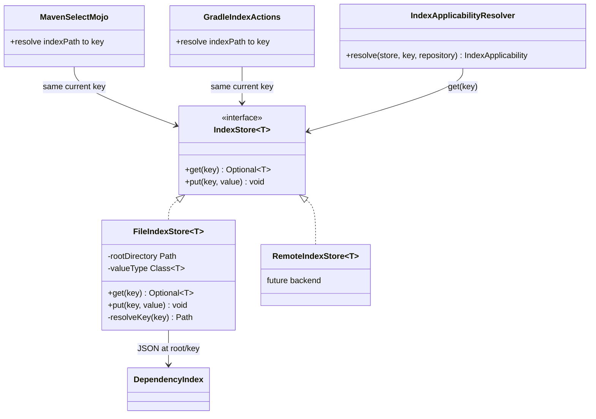
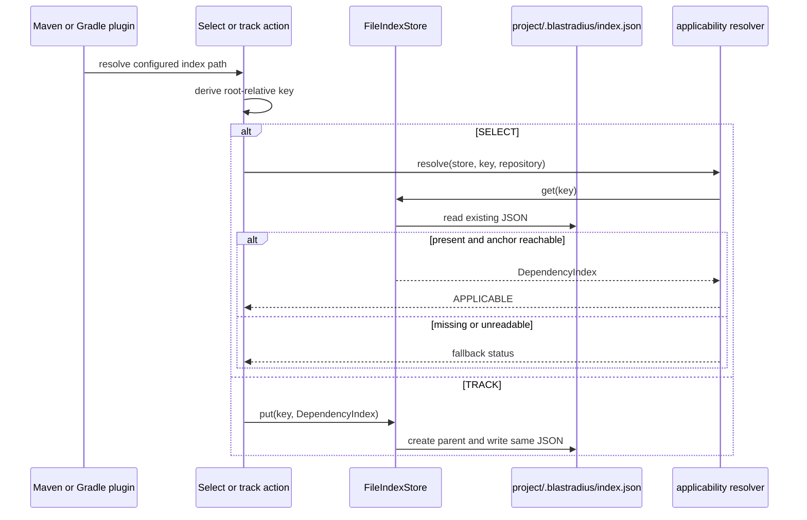

# Design: Abstract the index store behind an interface (#25)

started: 2026-07-20

## Class diagram

## Sequence: read or write an existing local index

## Design

- Add public generic `IndexStore<T>` and `FileIndexStore<T>` to `blastradius-core`. The store
  accepts an opaque string key; `FileIndexStore` resolves it under a configured root, rejects a
  key that escapes that root, and uses Jackson plus a value type to persist JSON.
- Rewire both build plugins' duplicate `DependencyIndexReader`/`DependencyIndexWriter` pairs to
  the core store. Their current `.blastradius/index.json` location becomes the root-relative key,
  so the on-disk path and JSON format remain unchanged.
- Create `FileIndexStore` inside Gradle's `doFirst`/`doLast` task actions from simple root and
  path inputs. This keeps Gradle configuration-cache state free of a live store or Jackson mapper
  while SELECT and TRACK still use the same derived key.
- Make `IndexApplicabilityResolver` depend on `IndexStore<DependencyIndex>` plus a key rather
  than constructing a file reader. A missing or unreadable value continues to produce the same
  safe full-suite fallback; it never becomes a build failure or an empty selection.
- Keep commit-keyed naming, remote credentials, retry policy, and index-format changes out of
  this slice. #26 may replace the current path-derived key with a commit key; #27 may supply a
  remote `IndexStore` implementation without changing callers.

## Constitution check

- **§I — TDD:** add failing direct tests for missing, round-trip, directory creation, and
  root-escape rejection before production code; keep existing Maven/Gradle index behavior tests.
- **§II — simplicity:** the interface is justified by two current consumers with duplicated
  local JSON I/O (Maven and Gradle), and by the already-planned remote backend. It owns only
  `get`/`put`, not key policy or transport concerns.
- **§III — safety:** absent, corrupt, or inaccessible indexes continue to fall back to the full
  suite. Root containment prevents a configured key from reading or writing outside the project.
- **§IV — deterministic core:** the caller supplies a stable root-relative key; no time-based
  lookup, network retry, or probabilistic behavior is introduced.

## Validation

1. Core unit tests prove `FileIndexStore` returns empty for a missing key, round-trips JSON,
   creates parent directories, and rejects a root-escaping key.
2. Maven and Gradle unit tests prove the unchanged `.blastradius/index.json` key preserves
   successful select/track behavior and missing/corrupt-index fallbacks.
3. Run `mvn clean verify` for the Maven reactor and `./gradlew test` for the Gradle plugin,
   including its TestKit functional coverage and configuration-cache reuse check.
