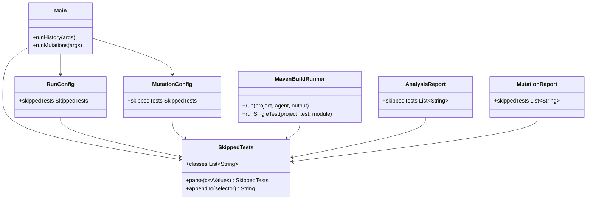
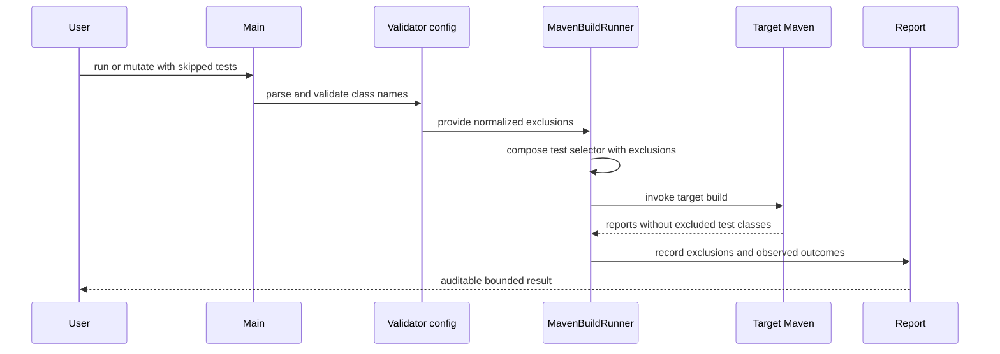

# Design: Add explicit flaky-test exclusions to validator target builds

started: 2026-08-02

## Purpose

Known flaky test classes can invalidate or slow a validator run even though the operator already knows they are not useful evidence. The optional `--skipped-tests` argument accepts a comma-separated list of fully qualified test class names. The validator passes those exclusions to every target-project Maven invocation, so the tests never execute in baseline builds, head builds, mutation builds, or confirmation reruns.

The option is deliberately opt-in and class-level. It does not claim the resulting report covers the excluded tests, and the report records the exact exclusions so its evidence boundary remains auditable.

## Class diagram

`SkippedTests` is a value object shared by both validator actions. It owns parsing, normalization, and selector composition, avoiding two subtly different interpretations of the same CLI value.

## Sequence: excluded target build

## Selector contract

For a full target build, the runner emits one Surefire selector containing negative patterns, such as `-Dtest=!org.app.FlakyTest,!org.app2.Flaky2Test`. For a single-test confirmation, it appends the same negative patterns to the positive test selector. Maven's no-specified-tests safeguards are enabled whenever a selector is present, so a reactor module containing only an excluded test does not abort the remaining modules.

Whitespace around comma-separated values is ignored, duplicates are removed while preserving order, and blank entries are rejected. This first version intentionally accepts classes, not individual methods or wildcard patterns: exact names match the operator's known-flake inventory and make the excluded evidence boundary unambiguous.

## Test slices

1. Parse, normalize, and compose deterministic exclusions.
2. Verify Maven command construction for both full-suite and single-test commands.
3. Propagate exclusions through historical and mutation configs and record them in JSON and text reports.
4. Add a fixture integration where an excluded permanently failing test no longer contaminates a validator run, while a non-excluded test still executes.

## Constitution check

- **I — TDD:** parsing, command composition, and fixture behavior each begin with focused failing tests.
- **II — simplicity:** one small value object is shared instead of a generic Maven-argument escape hatch.
- **III — safety:** exclusions are explicit, opt-in, and surfaced in output. They remove evidence from the report rather than silently classifying a flaky outcome as a pass.
- **V — explainability:** JSON and text summaries identify the test classes that were intentionally not run.
