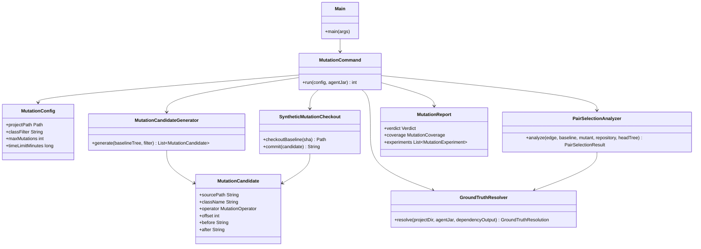
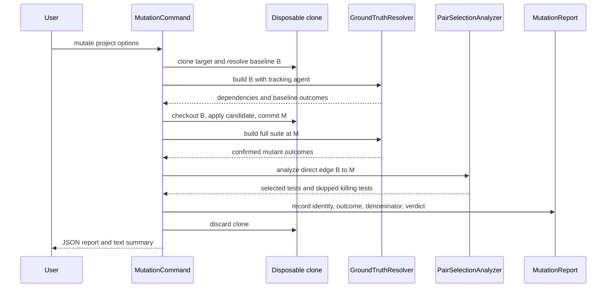

# Design: Add opt-in, bounded mutation-based validator soundness validation for issue 187

started: 2026-08-01

## Purpose

Historical replay observes whatever regressions happened to be committed. A mutation run deliberately introduces a small, controlled defect and checks whether Blastradius selects every test that demonstrably catches it. It strengthens evidence about selection soundness, but it is not a proof that every real change or every possible defect is covered.

The feature is a separate `mutate` CLI action rather than an extra default on `run`. Mutation testing is expensive and changes a scratch clone, so requiring an explicit action keeps historical validator behavior and its safe default intact.

## Operator contract

`mutate` accepts a Maven Java project and resolves its current `HEAD` as baseline `B`. It offers bounded, deterministic work through a production-class filter, maximum candidate count, and wall-clock time limit. Candidate files and token locations are sorted before limits are applied, making the same baseline and options produce the same sampled corpus.

The initial mutation set is deliberately small: boolean-literal inversion and equality or relational operator inversion. Each replacement preserves the source token category, so a candidate starts from a compilable expression shape. The mutant build remains the final authority: an unbuildable mutation is reported, never treated as a selection failure.

For one mutation, the oracle is:

1. A full-suite build of `B`, with the tracking agent, records dependencies and baseline test outcomes.
2. The runner writes the mutation only in a disposable clone and commits it as `M`, whose direct parent is `B`.
3. A full-suite build of `M` establishes outcomes. Every initially failing test is rerun by the existing `GroundTruthResolver`.
4. A test is a killing test only if it passed at `B` and is `CONFIRMED_FAILED` at `M`. A failure that passes on confirmation is a flake, and a failure already present at `B` is not eligible.
5. The shared pair-selection path evaluates the real Git edge `B -> M`. Every eligible killing test must be selected. Any skipped killing test makes the mutation verdict fail.

## Class diagram

`PairSelectionAnalyzer` is the one shared seam: both history replay and mutation replay give it a direct Git edge plus established baseline and head builds. This prevents mutation mode from quietly becoming a different selection implementation.

## Sequence: one mutation experiment

## Result model

`MutationReport` keeps all attempted experiments rather than only successful ones. Its coverage denominator separately records generated candidates, time or limit-skipped candidates, unbuildable mutants, baseline-clean mutants, mutants with confirmed killing tests, confirmed killing tests, selected killing tests, skipped killing tests, and flaky mutant failures. Each experiment contains the mutation identity, synthetic SHA, build outcome, confirmed killing tests, selected killing tests, and skipped killing tests.

The overall verdict is `PASS` when no eligible killing test was skipped. It is `FAIL` when at least one confirmed killing test was skipped. A run-level inability to establish the baseline or write a report remains exit code `2`; individual bad mutants are observations in the report, not reasons to discard the run.

## Test slices

1. Define and test deterministic candidate generation and bounded filtering.
2. Define and test scratch-clone mutation commits: `M` has `B` as its direct parent and the source repository worktree is unchanged.
3. Extract and test the shared pair-selection seam from historical replay.
4. Add mutation oracle classification and report and text-rendering contract tests.
5. Add fixture-backed end-to-end cases for a correctly selected killing test and a deliberately untracked, skipped killing test.
6. Wire the opt-in CLI, documentation, and a real Maven-project smoke run.

## Constitution check

- **I — TDD:** each slice starts with focused failing tests; fixture integration comes after the small deterministic units.
- **II — simplicity:** the first operator set is intentionally narrow and needs no parser framework or mutation-engine dependency.
- **III — safety:** a verdict only speaks about confirmed killing tests. Build failures, flakes, and pre-existing baseline failures stay visible but are excluded from the soundness denominator.
- **IV — deterministic core:** candidate ordering, sampling, and operators are fixed and opt-in, with no statistical inference.
- **V — explainability:** each reported outcome retains source location, replacement, synthetic edge, killing tests, and selection result.
- **VII — cleanup:** the synthetic clone is disposed after the run; every mutation returns to `B` before the next one so no build or source state leaks between experiments.
