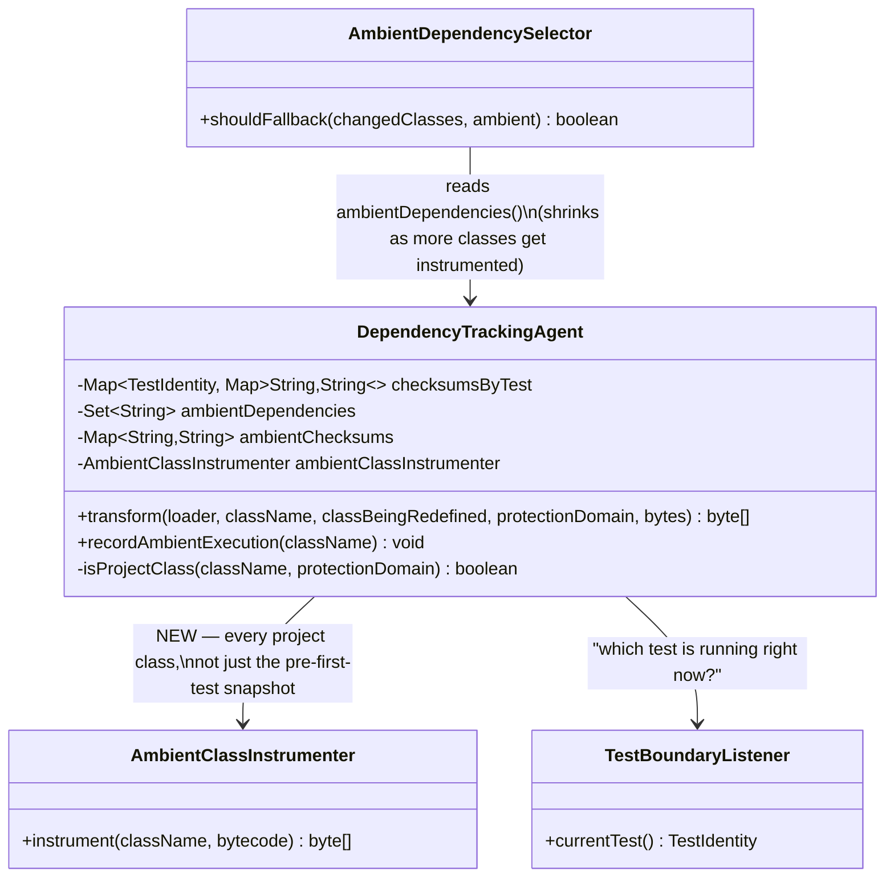
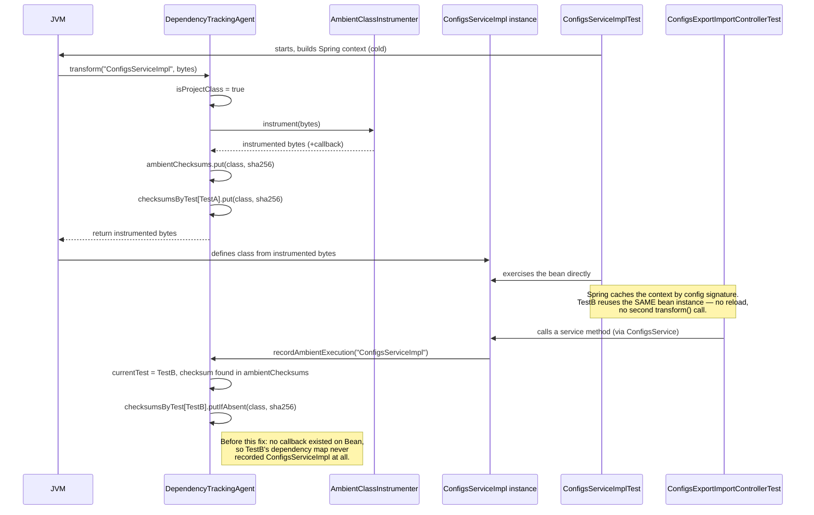

# Design: attribute a project class's runtime use to every test that exercises an already-loaded instance, not just the test whose window first loaded it

started: 2026-07-28

**Problem:** on real apache/shenyu, a change to `ConfigsServiceImpl.java` selected 0 of
3627 tests. Root cause: it's a Spring-managed bean, instantiated once when the *first*
test class needing that `ApplicationContext` runs — Spring then caches and reuses that
context for every later test class with the same config. The agent's `transform()` only
fires once per class-load, so only the first test that happened to trigger the load ever
got attributed. Not Spring-specific: true of any singleton/cached/pooled project class.

**Fix:** `AmbientClassInstrumenter` already injects a runtime-use callback into a class's
bytecode — today wired up only for the one-time, pre-first-test "ambient snapshot". This
generalizes it to run from `transform()`'s normal path, for every project class, the
first time it loads, whether or not a test is currently running — so a later test that
reuses an already-loaded instance still gets attributed via the injected callback.

Full walkthrough (with the observed-bug context and the four decisions below) was shown
as an Artifact during design review; this file is the durable copy of the two diagrams.

## Class diagram

## Sequence: two tests, one cached Spring context

