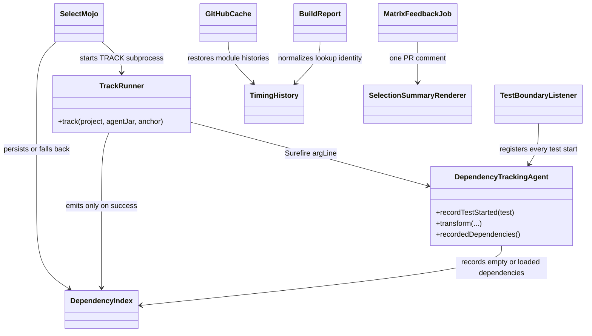

# Design: Backfill CI test-selection reliability decisions from 2026-07-26

started: 2026-07-26

> Backfill record for merged PRs #89, #91, #92, #94, #96, #98, #99, and #102.
> Decision confirmations are recorded in the linked session.

## Class diagram



## Sequence: safe tracking and matrix feedback

```mermaid
sequenceDiagram
  participant CI as CI workflow
  participant Mojo as SelectMojo
  participant Runner as TrackRunner
  participant Fork as Surefire fork
  participant Agent as Tracking agent
  participant Cache as Cache and artifacts
  participant Feedback as Matrix feedback job

  CI->>Cache: restore root and module .blastradius
  Mojo->>Runner: TRACK needed
  Runner->>Fork: mvn test with agent in argLine
  Fork->>Agent: start test, then transform classes
  Agent->>Agent: preserve empty baseline; guard checksum recursion
  alt tracking succeeds
    Runner-->>Mojo: complete dependency index
    Mojo->>Cache: persist commit-keyed index
  else tracking fails
    Runner-->>Mojo: failure plus output tail
    Mojo->>Mojo: discard partial data and run full suite
  end
  CI->>Cache: upload each JDK report artifact
  Feedback->>Cache: download matrix reports
  Feedback->>Feedback: normalize timing identities and render one comment
```

## Backfilled design decision

The merged fixes preserve one invariant across the pipeline: selection data is either complete,
attributable, and comparable, or it is discarded in favor of a conservative full run. The agent
records a test even when it sees no dependency loads; the tracking process is isolated to
Surefire and commits an index only after success; JDK-25 checksum work cannot recurse through
class loading. CI retains timing data for every module, then aggregates both JDKs into one
explainable PR summary whose savings estimate uses the same test identity as discovery.
