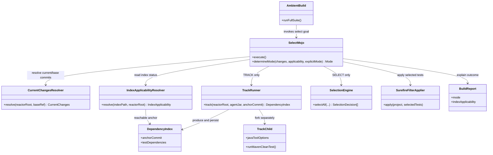

# Design: Backfill the CI-gating Maven plugin design decisions from PR #1

started: 2026-07-20

> **Backfill status:** reconstructed from contemporaneous sources and maintainer-confirmed on
> 2026-07-20. This document describes the shipped PR #1 design, not a proposed code change.

## Evidence and scope

- Contemporaneous sources: `specs/002-ci-gating-plugin/spec.md`, `plan.md`,
  `research.md`, `data-model.md`, and `contracts/mojo-and-index-contract.md`, plus the
  `SESSION.md` stored at PR #1 merge commit `c3cf16e`.
- Implementation evidence: PR #1's two implementation commits, `ad00c41` and `3c04c0c`,
  merged as `c3cf16e` from base `f0d1ba6`.
- Issue #51 names `219adbc` -> `f0d1ba6`; those are the setup commit and its immediate
  successor, not the PR #1 implementation diff. This scope discrepancy is preserved for
  maintainer review rather than silently resolved.

## Class diagram



## Sequence: one `blastradius:select` invocation

```mermaid
sequenceDiagram
  participant CI as CI build
  participant Mojo as SelectMojo
  participant Changes as CurrentChangesResolver
  participant Applicability as IndexApplicabilityResolver
  participant Track as TrackRunner
  participant Index as .blastradius/index.json
  participant Surefire as Ambient Surefire

  CI->>Mojo: process-test-classes
  Mojo->>Changes: resolve(baseRef, HEAD)
  Mojo->>Applicability: resolve(indexPath, reactorRoot)
  Applicability->>Index: read anchor + dependencies
  alt base-ref build or explicit track
    Mojo->>Track: fork mvn clean test with agent
    Track-->>Index: write anchored index
    Mojo->>Surefire: no filter; run full suite
  else reachable index on a non-base build
    Mojo->>Mojo: diff + SelectionEngine
    Mojo->>Surefire: apply selected-test filter
  else missing, unreadable, or unreachable index
    Mojo->>Surefire: no filter; run full suite
  end
  Mojo-->>CI: BuildReport
```

## Decision map

| Decision | Diagram nodes |
| --- | --- |
| Route one goal among TRACK, SELECT, and FALLBACK | `SelectMojo`, `CurrentChangesResolver`, `IndexApplicabilityResolver`, `SurefireFilterApplier`, `BuildReport` |
| Attach the agent only to a child Maven subprocess | `SelectMojo`, `TrackRunner`, `TrackChild`, `AmbientBuild` |
| Persist the index outside `target/` | `DependencyIndex`, `IndexApplicabilityResolver`, `.blastradius/index.json` |
| Treat a reachable recorded anchor as applicable | `DependencyIndex.anchorCommit`, `IndexApplicabilityResolver`, `CurrentChangesResolver` |

## Review point: index-anchor semantics

The maintainer confirmed the contemporaneous intent: an index anchored to an older reachable
base commit remains usable when the diff can be computed from that anchor. The shipped
`IndexApplicabilityResolver` checks reachability, while `CurrentChangesResolver` computes its
diff from the currently configured `baseRef`. This docs-only backfill makes no runtime change;
whether those code paths implement the confirmed intent remains a separate follow-up.
