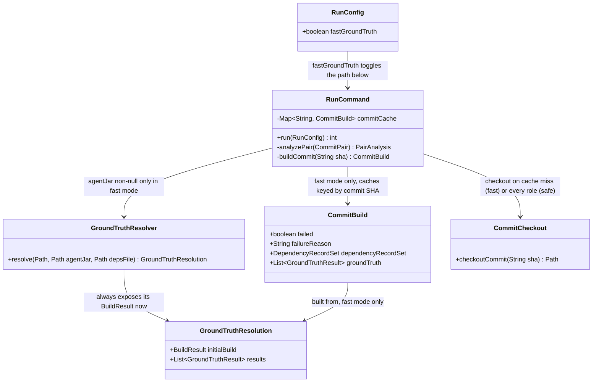
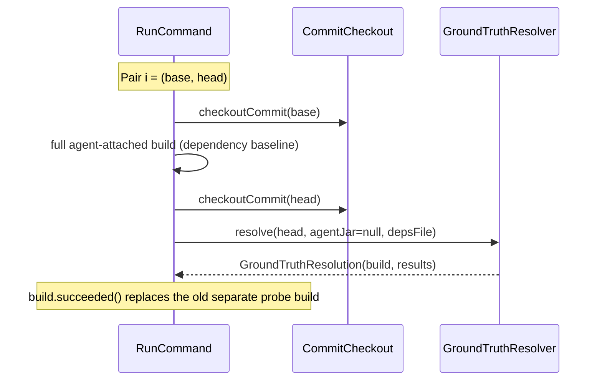
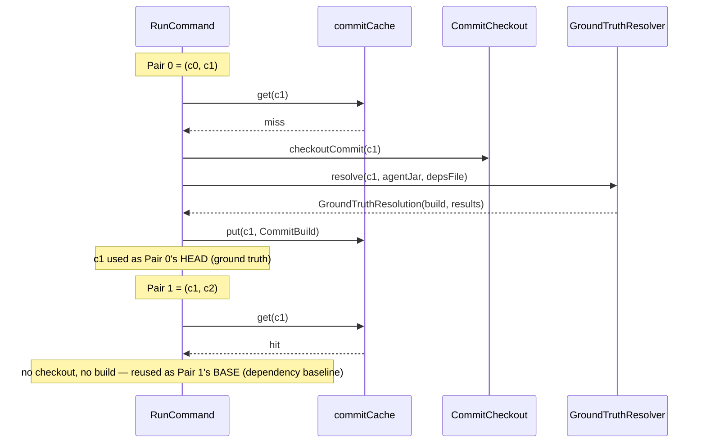

# Design: cache commit build results across the sliding window to eliminate redundant validator builds

started: 2026-07-28

Today each analyzed commit pair triggers up to 3 full `mvn clean test` invocations: an
agent-attached base build, a discardable agent-free head "probe" build, and
`GroundTruthResolver`'s own internal agent-free build — the last two are the same build type,
run back-to-back, purely because `GroundTruthResolver` never exposed its `BuildResult` to the
caller.

This feature ships two tiers:

- **Safe (default, no flag):** removes the redundant probe build unconditionally. `2N` builds
  instead of `3N`. Zero behavior change — `GroundTruthResolver` was always going to run that
  build; it just wasn't telling `RunCommand` what happened.
- **`--fast-ground-truth` (opt-in):** goes further by unifying build types — every commit gets
  one canonical, agent-attached build, cached in-memory for the run and reused across every
  pair that references it. `N+1` builds. This trades the ground-truth build's independence from
  the tracking agent for speed, so it is never the default — see the decision below.

## Class diagram

## Sequence: safe mode (default) — probe eliminated, roles stay separate

## Sequence: --fast-ground-truth — a commit shared by two pairs

## Constitution tension and how the design resolves it

Constitution §III (Safety Over Speed) forbids a design decision that *silently* weakens
soundness in favor of speed. Unifying build types unconditionally would do exactly that: the
validator's ground-truth oracle would stop being independent of the agent it's validating, for
every run, without anyone asking for it.

Gating the unification behind `--fast-ground-truth` (default off) resolves the tension rather
than relocating it: the safe path is exactly as sound as it is today for any run that doesn't
pass the flag, and passing it is a visible, explicit, per-run choice — not an inherited weaker
default. This is read as compliance with §III's actual concern (silence), not an exception to
it.

Rejected alternative: unify unconditionally, no flag. Same `N+1` build count on every run, but
applies the trade to runs that never asked for it.

## Known accepted inefficiency (fast mode only)

Under `--fast-ground-truth`, the window's very first commit (base-only, never anyone's head)
still goes through the full ground-truth path, including flaky-confirmation reruns for any of
its failing tests — work nobody consults. Bounded by that one commit's failing-test count;
keeping `buildCommit` uniform (no lookahead into "will this SHA ever be a head") is the simpler
shape. Safe mode is unaffected.
