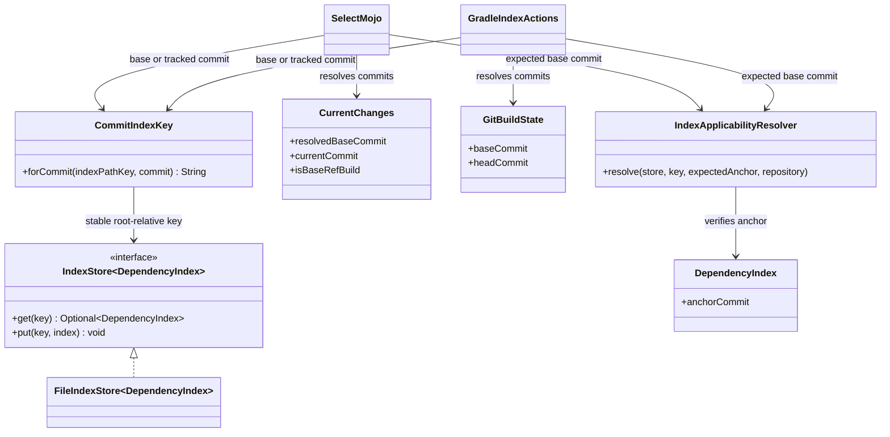
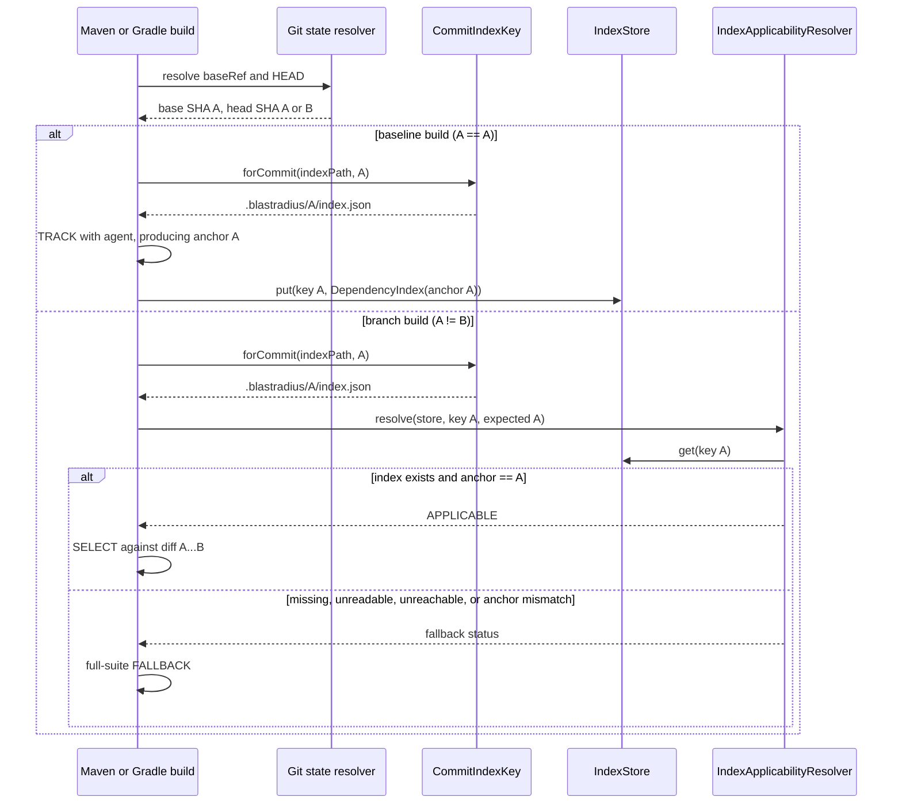

# Design: Commit-keyed index baseline resolution (#26)

started: 2026-07-20

## Class diagram

## Sequence: store on baseline, select on a branch

## Design

- Add one small core key strategy, `CommitIndexKey`. It turns the existing root-relative
  `indexPath` into a commit namespace by inserting the full resolved SHA before the configured
  filename: the default `.blastradius/index.json` becomes
  `.blastradius/<commit>/index.json`. A custom path keeps its parent and filename, so it remains
  a stable storage namespace rather than becoming a new configuration surface.
- Maven resolves `CurrentChanges` before accessing storage. TRACK writes under
  `currentCommit`; SELECT looks up the key for `resolvedBaseCommit`, which is also the commit the
  diff begins from.
- Gradle already has those two resolved SHAs in `GitBuildState`. Its configuration-cache inputs
  use the exact base-keyed file, while its `doFirst`/`doLast` actions derive the same keys and
  construct `FileIndexStore` only at execution time.
- Both applicability resolvers accept the expected baseline SHA and require it to equal the
  loaded index's `anchorCommit`. A missing key, bad JSON, unreachable anchor, or mismatched anchor
  yields a named fallback status and leaves the full suite unfiltered.
- Do not read or migrate the old unkeyed file. It cannot prove which baseline it represents; the
  first branch build therefore safely falls back until a baseline TRACK build writes the keyed
  index. Remote transport belongs to #27, merge-base selection to #28, and schema versioning to
  #29.

## Constitution check

- **§I - TDD:** add direct red tests for key derivation and anchor mismatch before wiring Maven
  and Gradle; keep real Maven and Gradle TRACK-to-SELECT coverage.
- **§II - simplicity:** one shared key strategy is warranted because both adapters now need the
  identical on-disk and future-remote object name; no backend configuration is added.
- **§III - safety:** only an index stored for, and declaring, the exact diff baseline may select
  tests. Every ambiguity becomes a full-suite fallback.
- **§IV - deterministic core:** a resolved full SHA deterministically maps to one key; no network
  lookup, time-based search, or heuristic is introduced.
- **§V - explainability:** an anchor mismatch gets its own reported fallback reason instead of
  looking like a successful selection or an unexplained absence.

## Validation

1. Core tests prove a root-relative template plus commit maps to the expected key and rejects
   unsafe inputs.
2. Maven and Gradle resolver tests prove a matching base-keyed index selects, while a missing or
   mismatched baseline index falls back.
3. Maven end-to-end and Gradle TestKit tests prove TRACK writes the current commit's key and a
   later branch SELECT reads its resolved base commit's key.
4. Run `mvn clean verify` and `./gradlew test`.
