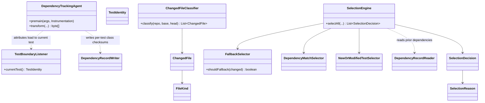
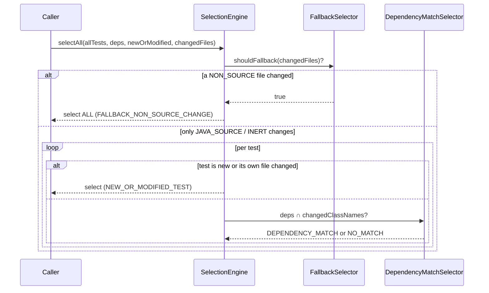

# Design: core dynamic dependency tracking and test-selection engine

started: 2026-07-12

> ✓ **Backfilled, then reviewed.** `blastradius-core` shipped in the initial commit without going
> through the loop. This design was reconstructed from the code, the validator's Phase-0 ADR
> (`specs/001-shadow-mode-validator/research.md`), and the constitution — not authored live — then
> confirmed by the maintainer on 2026-07-12. Diagrams reflect the engine as it shipped. See the
> session journal for the decisions and their (now ✓) trust markers.

## Class diagram

## Sequence: selecting tests for one commit pair

