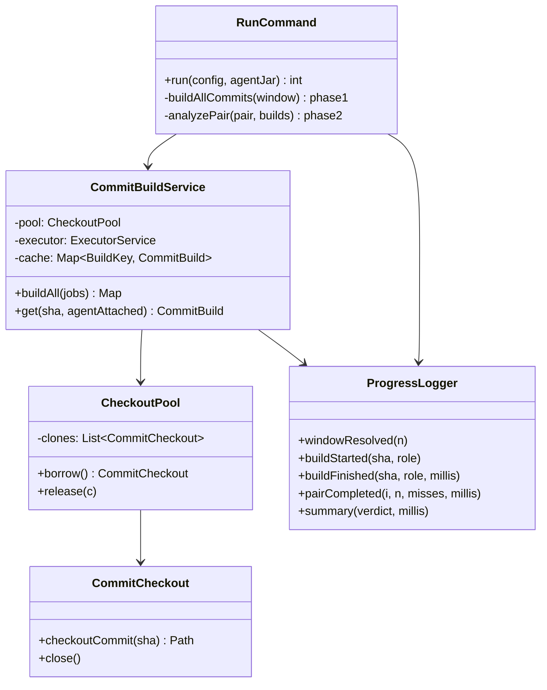
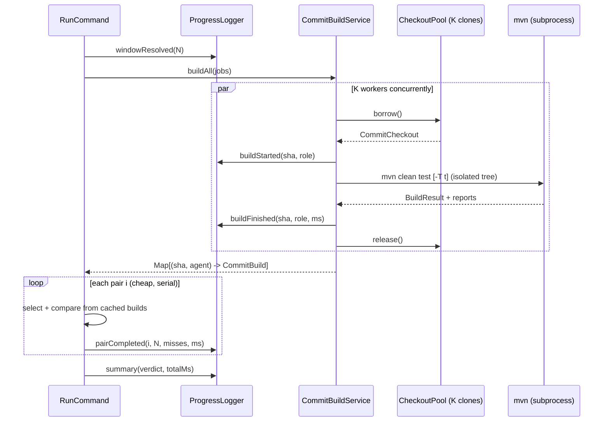

# Design: cut shadow-mode validator time below 2 min per commit pair and log intermediate progress

started: 2026-07-30

## Problem

Shadow-mode averages ~6 min per commit pair. Profiling the pipeline by hand shows the
cost is almost entirely **Maven builds**; everything else (git checkout, tree walks,
selection, comparison) is negligible next to one `mvn clean test` of a real reactor.

Two hard constraints shape the fix:

- **Constitution &sect;III (Safety Over Speed).** `--fast-ground-truth` (one agent-attached
  build per commit, reused as both dependency baseline and ground truth) trades away the
  ground-truth oracle's independence from the tracking agent, so it MUST stay opt-in and
  can never become the default. **Build *count* is therefore not a lever we may pull in the
  default path.**
- The operator here already runs `--fast-ground-truth --maven-threads N`, so build count is
  already minimal (N+1 builds for N pairs) and each build already uses Maven's `-T`. At that
  point ~6 min/pair &asymp; one full reactor build.

The only remaining lever that reaches &lt;2 min/pair is **running the per-commit builds
concurrently across isolated working trees**. A single reactor build under `-T` still stalls
whenever the module dependency graph narrows (idle cores on the critical path); filling those
idle cores with *other commits'* builds recovers the wall-clock a single `-T` build leaves on
the table. The box has 8+ cores and ample RAM.

## Approach

1. **`ProgressLogger`** &mdash; timestamped lines to stderr so the jar is no longer silent.
   Logs window resolution, each build start/end + duration, each pair completion +
   would-miss count, and a final roll-up. Off by default only in the sense that stderr is
   separate from the machine-readable report on stdout/`--report-out`.
2. **`CommitBuildService`** &mdash; owns a bounded pool of `K` isolated `CommitCheckout`
   clones and an executor of `K` workers. Enumerates every build job the window needs
   (fast mode: distinct commits, agent-attached; safe mode: per-pair base-with-agent +
   head-without-agent), submits them all, and memoizes results by `(sha, agentAttached)`.
   Reusing whole `CommitCheckout` instances keeps &sect;VII's exhaustive `target/` cleanup and
   the non-destructive-clone guarantee intact, and adds no git-CLI dependency (we already
   fight `mvn`-not-on-PATH on Windows).
3. **`RunCommand` split into two phases** &mdash; phase 1 builds all commits concurrently
   (the expensive part, now core-saturated); phase 2 runs the cheap per-pair selection +
   comparison serially over the cached builds. Correctness is unchanged: the same builds,
   the same comparisons, only reordered and parallelized.
4. **`--build-concurrency K`** (default `1` &rarr; today's exact serial behavior, so no
   surprise for existing callers). Recommended combo on an 8-core box: a modest `-T` per
   build times `K` concurrent builds &asymp; core count (e.g. `-T 2` &times; `K 4`).

Non-goals: changing build count in the default path (&sect;III), replacing Maven, or touching
the selection engine's semantics.

## Class diagram

## Sequence: concurrent build then serial analysis

