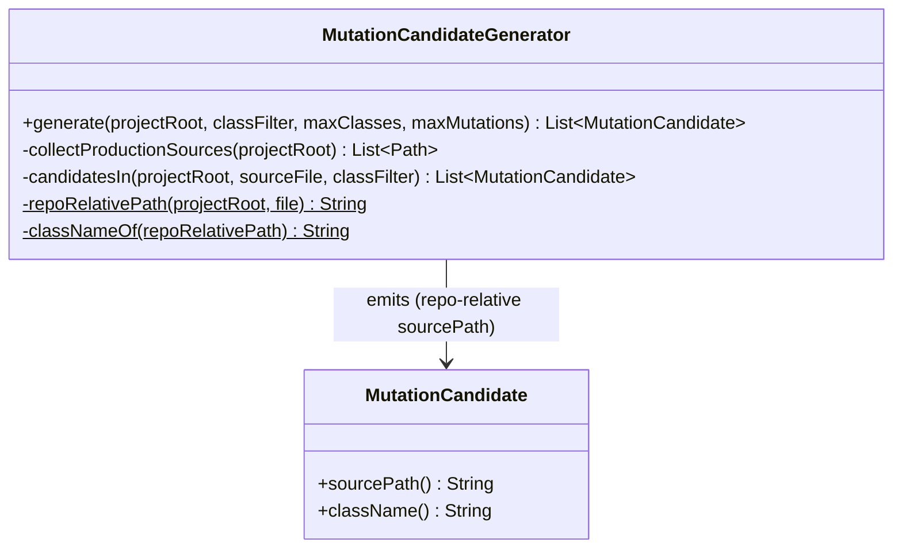
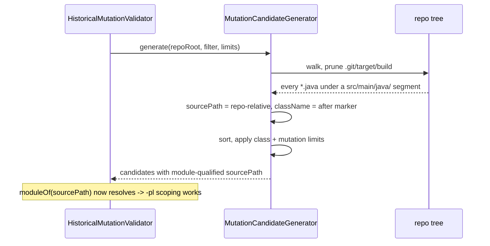

# Design: Discover per-module production source roots for mutation validation

started: 2026-08-02

## Problem

`MutationCandidateGenerator.generate()` resolves a single `<projectRoot>/src/main/java` and
returns `List.of()` when it doesn't exist. A real multi-module reactor (apache/shenyu) has NO
`src/main/java` at the repo root -- every source lives in a submodule
(`shenyu-common/src/main/java`, `shenyu-admin/src/main/java`, ...). So the generator finds zero
classes, mutation validation generates zero mutants, and every reactor silently reports PASS
having tested nothing. (Confirmed live: a 1-pair shenyu run produced `generated: 0`.)

## The change

Walk the whole tree from `projectRoot` (pruning `.git`, `target`, `build`) and collect every
`.java` file that sits under a `src/main/java/` segment -- one production root per module,
discovered rather than assumed. For each file:

- **`sourcePath`** becomes **repo-relative** (`shenyu-common/src/main/java/.../Flag.java`) instead
  of module-relative, so `HistoricalMutationValidator` can resolve it to its owning module via
  `ReactorModuleGraph.moduleOf(...)` for the `-pl` scoping already built.
- **`className`** is derived from the path *after* the `src/main/java/` marker (same trick
  `TestModuleIndex.classNameOf` uses for `src/test/java/`), so the FQN is correct regardless of
  which module the file lives in.

Deterministic ordering and the class/mutation limits are unchanged: sort by repo-relative path,
limit classes, then sort candidates by `(sourcePath, offset)` and limit mutations.

Test sources (`src/test/java`) and generated output (under `target/`) carry no `src/main/java/`
marker (or are pruned), so they are never mutated.

## Class diagram

## Sequence: enumerating a multi-module reactor

