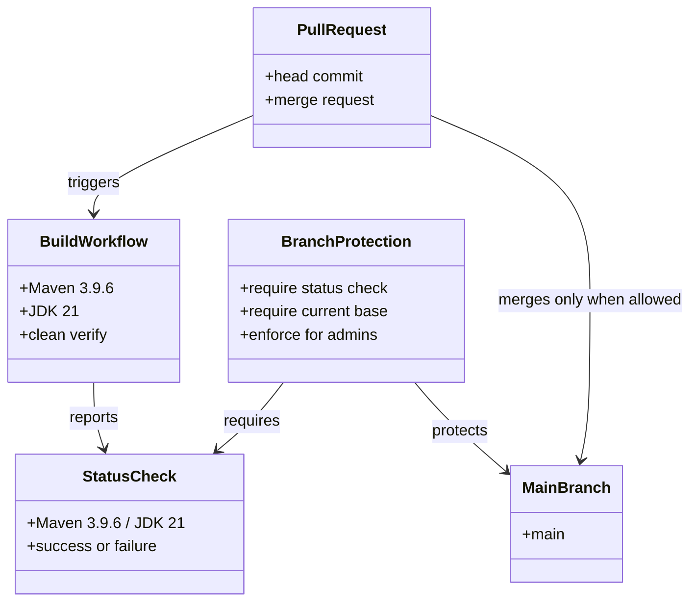
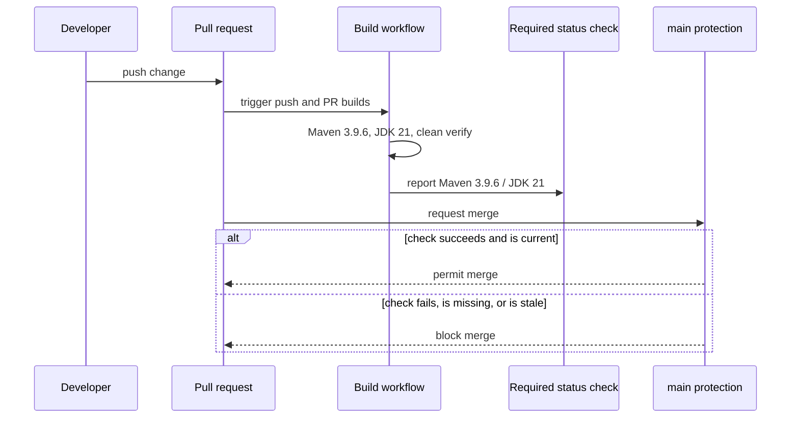

# Design: enforce the required JDK 21 build check on main

started: 2026-07-20

## Protection shape

## Merge flow

## Key decision

Require the existing `Maven 3.9.6 / JDK 21` check with strict freshness and admin
enforcement. This protects the same full-suite build already used by the repository without
introducing a second workflow or weakening the gate for administrators.
