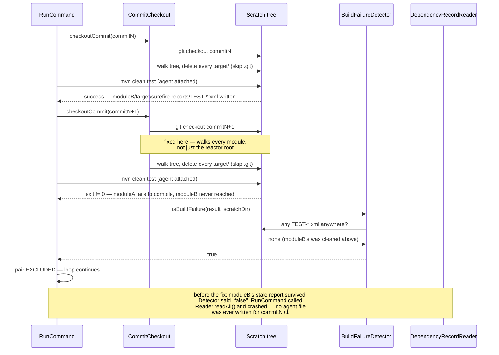

# Design: fix CommitCheckout to clear stale target/ dirs in every submodule, not just the reactor root, when reusing a scratch clone across commits

started: 2026-07-27

## Context

`RunCommand` reuses one scratch clone (`CommitCheckout`) across every commit pair in the
validator's window. `checkoutCommit()` used to delete only the reactor-root `target/` between
checkouts. On a multi-module target project, a module's own `target/` survives a checkout if the
next commit's build never reaches that module (e.g. it fails to compile earlier in the reactor).
`BuildFailureDetector` only asks "does any `TEST-*.xml` exist anywhere under the project?" — a
stale one from the *previous* commit answers yes, so it wrongly treats a real build failure as a
completed test run, and `RunCommand` crashes trying to read dependency-tracking output the agent
never produced for that commit. Found running the validator against `apache/shenyu` (dozens of
modules).

## Class diagram

```mermaid
classDiagram
  class CommitCheckout {
    -Path scratchDir
    -Git scratchGit
    +forTargetProject(targetRepo, scratchParent) CommitCheckout
    +checkoutCommit(commitSha) Path
    +close()
    -deleteAllTargetDirectories(scratchDir)
    -deleteRecursively(path)
  }
  class RunCommand {
    -analyzePair(pair, targetRepo, checkout, agentJar)
  }
  class BuildFailureDetector {
    +isBuildFailure(result, projectDir) bool
    -anyTestReportsExist(projectDir) bool
  }
  class DependencyRecordReader {
    +readAll(baseOutputFile) DependencyRecordSet
  }
  class ScratchTree {
    <<shared filesystem state>>
    every module's target/
  }

  RunCommand --> CommitCheckout : checkoutCommit() per pair
  RunCommand --> BuildFailureDetector : isBuildFailure()
  RunCommand --> DependencyRecordReader : readAll() when not excluded
  CommitCheckout ..> ScratchTree : cleans (was: root only, now: every module)
  BuildFailureDetector ..> ScratchTree : reads (any TEST-*.xml, fresh or stale)
```

The bug is coupling through `ScratchTree`, not through a method call: `CommitCheckout` and
`BuildFailureDetector` never call each other, but they silently agree on the filesystem being
clean between commits. Only cleaning the root broke that agreement for every submodule.

## Sequence: two checkouts in the same scratch clone, one submodule behind a build failure


