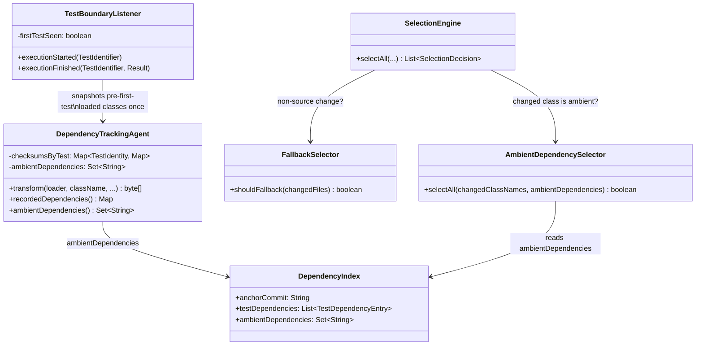
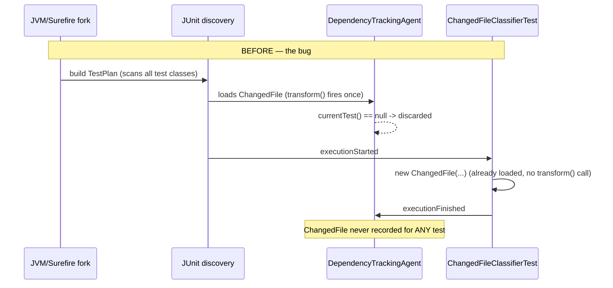
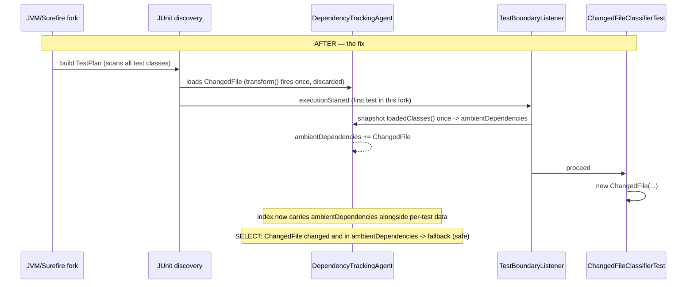

# Design: fix dependency-tracking agent missing classes loaded before a test's tracking window opens

started: 2026-07-26

## Bug (confirmed by local repro)

`DependencyTrackingAgent.transform()` is a plain `ClassFileTransformer`, registered without
`canRetransform`, so the JVM invokes it exactly once per class — on that class's first load in
the fork. JUnit Platform's discovery pass (building the `TestPlan` from every test class's
methods/annotations) happens before `TestBoundaryListener.executionStarted` ever fires for the
first test, and can force-load a class like `ChangedFile` during that pass. Once loaded, it is
never re-transformed, so it is permanently invisible to the tracker for the rest of the fork —
even for tests that construct/use it directly and run later. Verified locally: 0 of 217 recorded
test executions in blastradius-core's freshly-tracked index list `ChangedFile` as a dependency,
despite three tests (`ChangedFileClassifierTest`, `SelectionEngineTest`, `FallbackSelectorTest`)
constructing it directly.

## Class diagram

## Sequence: before (bug) vs after (fix)

## Rejected alternative

Retransform every already-loaded class at each `executionStarted` (`canRetransform=true` +
`Instrumentation.retransformClasses`) so `transform()` fires again, attributed to whichever test
is current. Rejected: it only reassigns the "first loader wins" problem to whichever test happens
to run first after the retransform, and re-running it per test is expensive across a large
classpath. The ambient-set approach captures the pre-discovery loaded-classes snapshot exactly
once per fork and treats it as fork-wide (a changed ambient class conservatively triggers
fallback), which is cheap and matches the system's existing philosophy of falling back rather
than guessing (FR-007) instead of trying to attribute what is structurally unattributable per-test.
