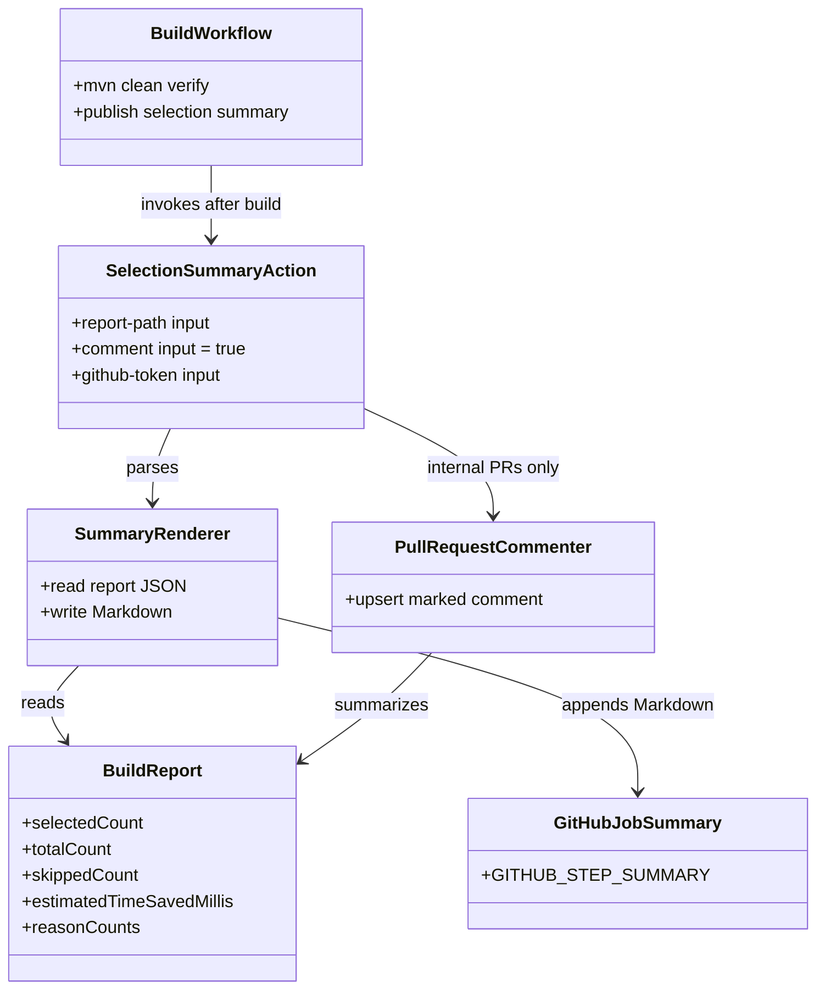
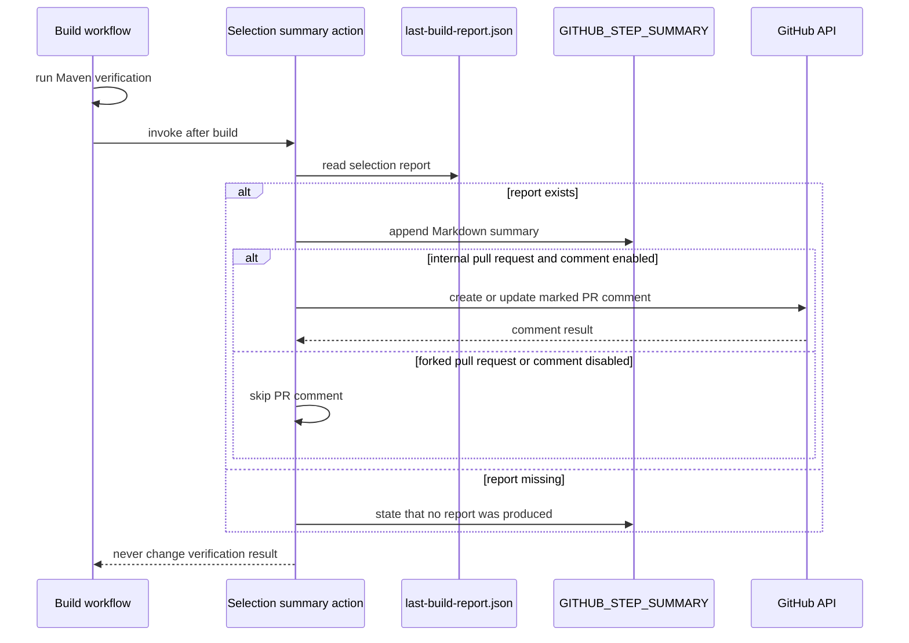

# Design: GitHub Actions job summary and PR comment (#33)

started: 2026-07-26

## Class diagram

## Sequence: publish CI feedback without affecting verification

## Rationale

The publisher is a composite GitHub Action rather than Maven-plugin code. Maven
produces a portable local report; GitHub Actions owns the event context, token,
job-summary surface, and pull-request permission boundary. This makes the
integration reusable by every workflow that runs `blastradius:select`.

The action always writes a job-summary entry, including when no report was
produced. PR comments are enabled by default for same-repository pull requests,
where the workflow grants `pull-requests: write`. They are intentionally skipped
for forks and are non-fatal, so feedback can never change the build result.

One stable HTML marker identifies the comment to update. This preserves a single
current result per pull request instead of adding a comment on every CI run.
