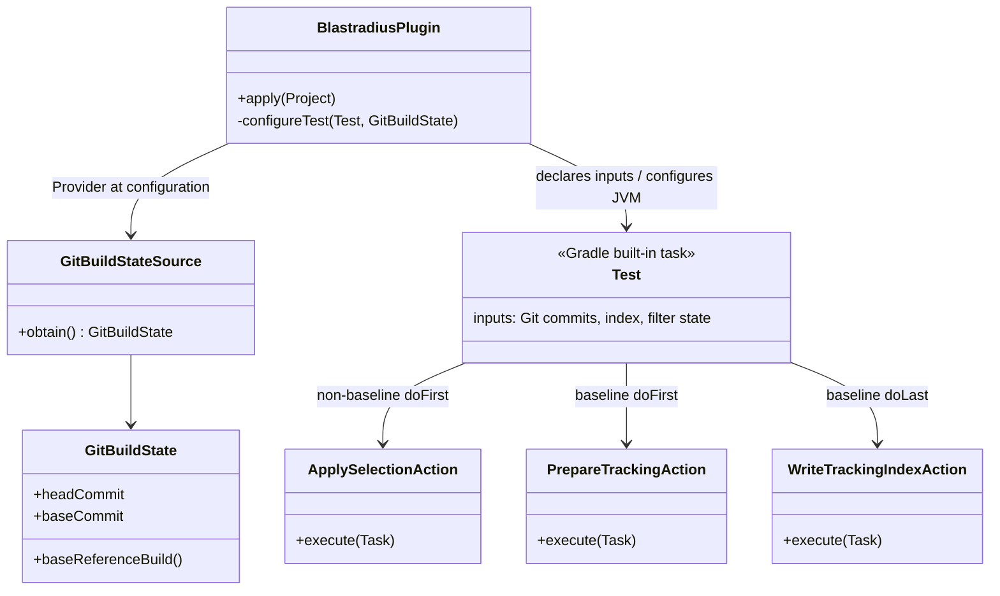

# Design: Gradle configuration-cache and up-to-date compatibility

started: 2026-07-20

## Class diagram



## Sequence: cache-safe Gradle build

```mermaid
sequenceDiagram
  participant G as Gradle configuration
  participant S as GitBuildStateSource
  participant P as BlastradiusPlugin
  participant T as Test task
  participant A as Execution action

  G->>P: apply plugin
  P->>S: obtain HEAD and base commit through Provider
  S-->>P: immutable GitBuildState
  P->>T: declare commit and index inputs
  alt HEAD equals baseRef
    P->>T: add agent JVM arg; disable output reuse
    P->>T: install record cleanup and index-write actions
  else feature build
    P->>T: install selection-filter action
  end
  G->>T: snapshot task inputs / decide up-to-date or cache hit
  T->>A: execute only if work is required
  A->>A: use captured files and strings, never Project
  T-->>G: reports or tracked index
```

## Boundaries and decisions

- `GitBuildStateSource` is a Gradle `ValueSource`: Gradle records its result as a configuration
  input, so changing `HEAD` or the configured base reference invalidates the configuration cache
  deliberately. The execution actions receive the resolved commit IDs rather than accessing a
  live `Project`.
- A feature-build `Test` declares the dependency index and Git commit IDs as inputs. Those are
  the values that determine its dynamically applied filter, so both up-to-date checking and the
  build cache distinguish different selections correctly.
- Baseline TRACK builds deliberately disable `Test` output reuse. The tracking agent has to run
  to produce fresh per-worker records; accepting an up-to-date or cache-hit test result would
  leave no records to turn into an index. This is intentional work, not a cache defect.
- The design keeps selection and tracking attached to Gradle's built-in `Test` task rather than
  adding a separate selector task. The existing task already owns compilation dependencies,
  classpath and test outputs; explicit inputs make the late filter safe without introducing an
  extra task protocol.
