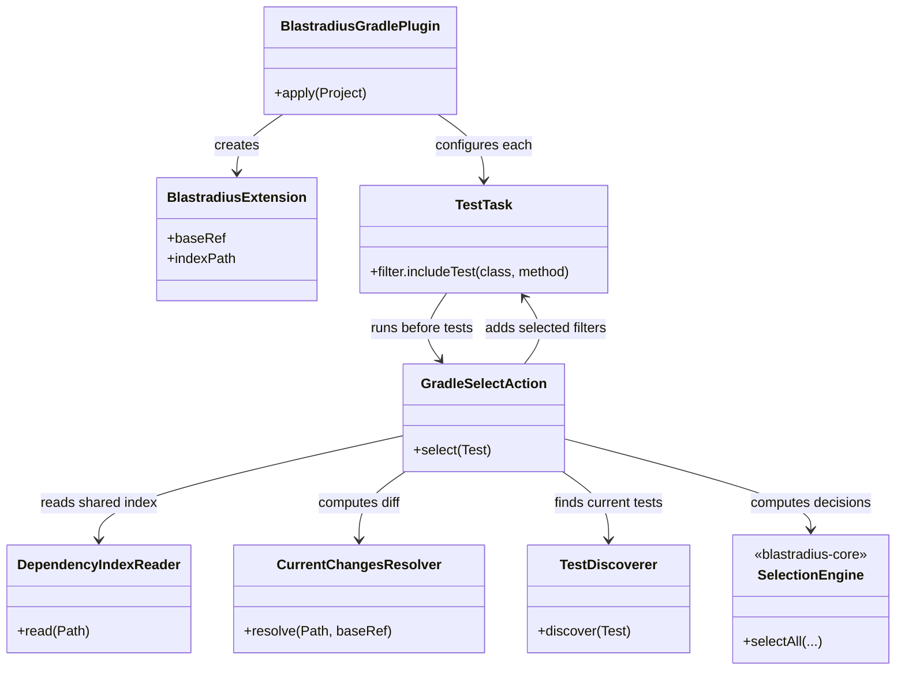
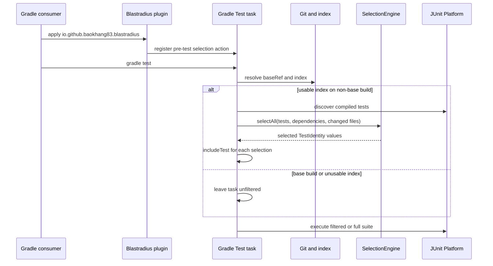

# Design: Gradle plugin scaffold and SELECT wiring

started: 2026-07-20

## Adapter shape

## SELECT flow

## Key decisions

- The new `blastradius-gradle-plugin` is a Gradle `java-gradle-plugin` adapter. It consumes
  `blastradius-core` directly and keeps selection rules in the existing core rather than copying
  them into Gradle code.
- The extension exposes the same `baseRef` and `indexPath` concepts as Maven. SELECT is applied
  through Gradle's `Test.filter.includeTest`, the programmatic equivalent of `--tests`.
- This issue implements only SELECT. A base-reference build or an unusable index leaves Gradle's
  test task unfiltered; TRACK agent wiring belongs to issue #20, and configuration-cache work to
  issue #19.
- Functional tests use Gradle TestKit to run a real temporary Gradle project. A configuration-only
  test would not prove that the `Test` task actually receives and honours the selected filters.
