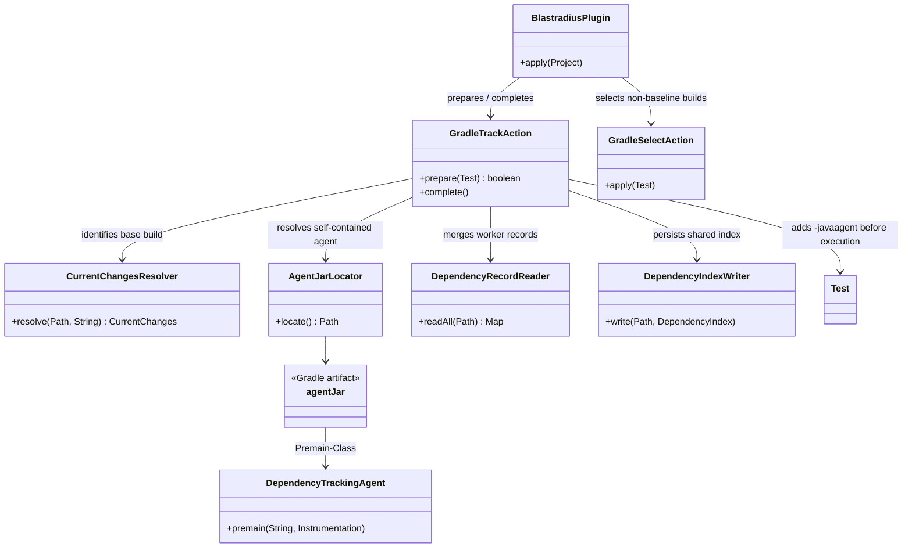
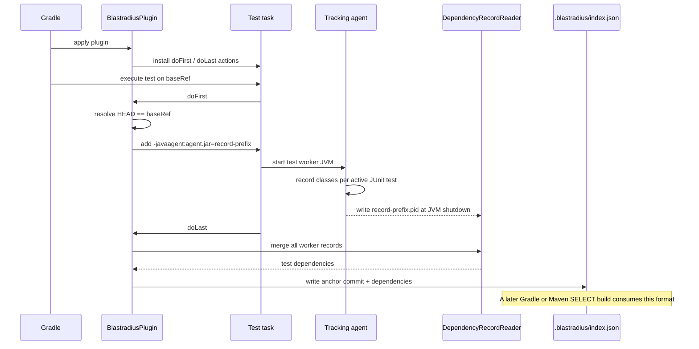

# Design: Gradle plugin TRACK mode agent wiring

started: 2026-07-20

## Class diagram

## Sequence: base-reference TRACK build

## Boundaries and decisions

- The existing `blastradius-core` Gradle project will expose a self-contained `agentJar` with
  the agent manifest and runtime dependencies. The Gradle plugin depends on that artifact, so
  `DependencyTrackingAgent` resolves to a real, attachable JAR both in a published plugin and
  in Gradle TestKit. A thin core JAR is not sufficient: `-javaagent` does not automatically
  bring Jackson, which the shutdown hook needs to write records.
- `GradleTrackAction` runs in the `Test` task's `doFirst`/`doLast` boundary. `doFirst` is early
  enough to add JVM arguments before Gradle forks the worker; `doLast` is late enough for every
  worker shutdown hook to have written its unique record. No nested Gradle build is needed.
- A base-reference build is TRACK; a non-base build keeps the existing SELECT/fallback path.
  TRACK never filters tests. Failure to read tracking output fails the TRACK build rather than
  publishing a partial index.
- This slice deliberately does not model tracking as cacheable Gradle task inputs or force
  up-to-date `Test` tasks to rerun; issue #19 owns that compatibility work. The functional
  proof starts from a clean consumer build, where Gradle executes the test task normally.
