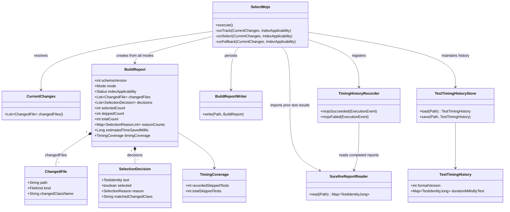
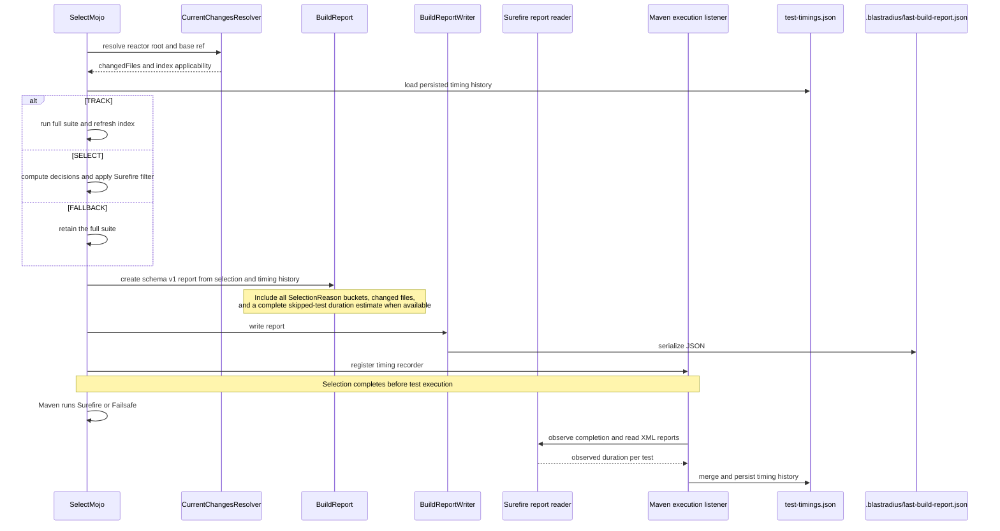

# Design: JSON selection report (#31)

started: 2026-07-26

## Class diagram



## Sequence: write one report for every selection mode



## Report contract

`BuildReport` remains the single source of truth; the console renderer continues to derive
its output from it. Every invocation writes schema version `1` at
`.blastradius/last-build-report.json`, with these stable fields:

```json
{
  "schemaVersion": 1,
  "mode": "SELECT",
  "indexApplicability": "APPLICABLE",
  "changedFiles": [
    { "path": "src/main/java/example/Foo.java", "kind": "JAVA_SOURCE", "changedClassName": "example.Foo" }
  ],
  "decisions": [
    { "test": { "className": "example.FooTest", "methodName": "works" }, "selected": true,
      "reason": "DEPENDENCY_MATCH", "matchedChangedClass": "example.Foo" }
  ],
  "selectedCount": 1,
  "skippedCount": 4,
  "totalCount": 5,
  "reasonCounts": {
    "DEPENDENCY_MATCH": 1,
    "FALLBACK_NON_SOURCE_CHANGE": 0,
    "NEW_OR_MODIFIED_TEST": 0,
    "NO_MATCH": 4
  },
  "estimatedTimeSavedMillis": 2430,
  "timingCoverage": { "recordedSkippedTests": 4, "totalSkippedTests": 4 }
}
```

`selectedCount` is the test set the goal tells Surefire/Failsafe to run; `skippedCount` is
the remaining discovered set. The goal executes before the test engines, so the report does not
claim final execution results. At the beginning of each build, the goal loads the versioned
per-test durations in `.blastradius/test-timings.json`. A Maven execution listener registered by
the goal observes Surefire/Failsafe completion, reads those standard XML reports, and merges the
fresh durations immediately - even when the build began with `clean`. For a SELECT build,
`estimatedTimeSavedMillis` is the sum of the persisted durations for every skipped test. It is
`null` until every skipped test has timing history; `timingCoverage` makes that status
machine-readable. TRACK and FALLBACK report zero skipped tests and zero estimated savings. All four
`SelectionReason` keys appear even when a mode has no per-test decisions, so CI consumers do not
need mode-specific missing-key handling.

## Key choice

The report extends the existing `BuildReport` rather than adding a parallel report model. That
keeps JSON, console rendering, and selection behavior tied to one immutable value and preserves
the existing output fields. A small versioned timing-history file is the second durable artifact:
it contains only test identity and last observed duration, is updated from Surefire/Failsafe's
standard XML reports immediately after the test engine completes, and remains useful when CI
restores `.blastradius/` as a cache. A listener injected into the test runtime was rejected
because it would add a second execution integration and risk changing the build; a synthetic
equal-cost percentage was rejected because it is not the milliseconds estimate requested here.
