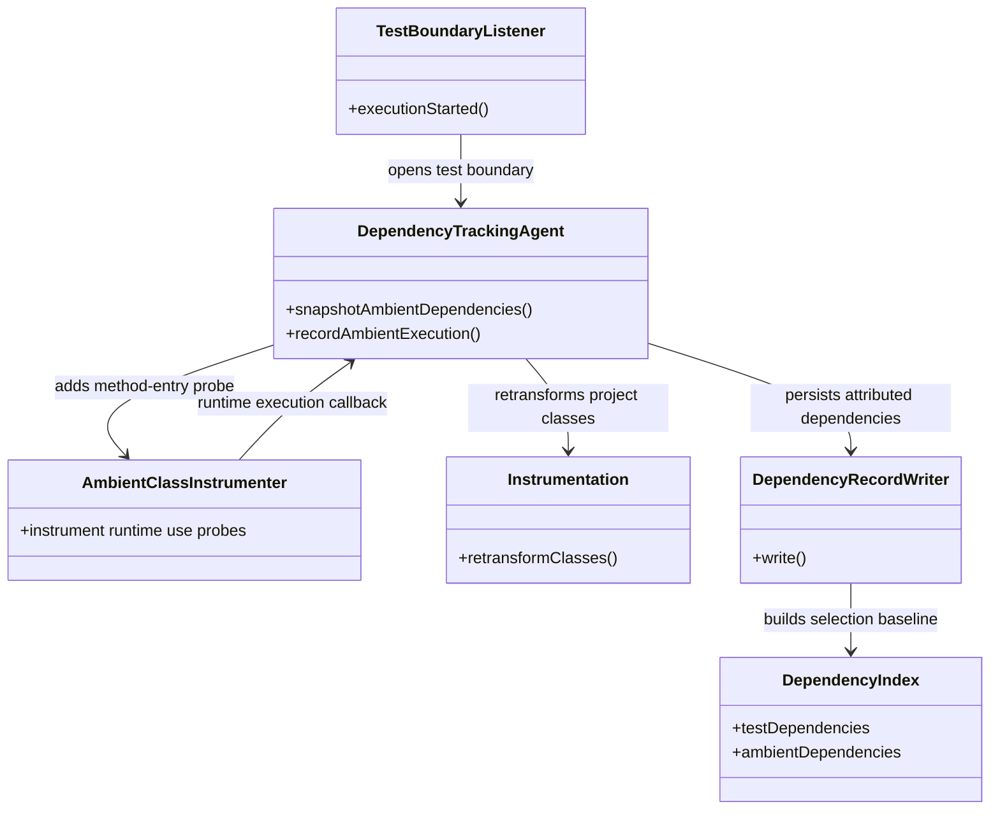
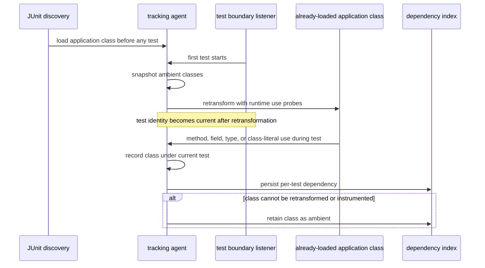

# Design: attribute discovery-loaded classes by runtime execution

started: 2026-07-27

## Class diagram

## Sequence: discovery-loaded application class

## Decision

Replace the static test-class scan with runtime attribution. At the first test boundary, the
agent retransforms discovery-loaded project classes and adds probes for method execution plus
field, type, and class-literal use. If a test later uses one of those classes, the probe records
the class under that test's normal dependency entry. Selection can then use the existing
dependency matcher, including indirect calls, reflection, dependency-injection paths, and direct
non-constant static-field reads that a static scan cannot see.

The ambient set remains the conservative escape hatch only for classes that cannot be safely
retransformed or instrumented. Those classes still trigger the existing full-scope fallback when
they change. The agent must instrument only project class-output directories, never JDK or third
party library classes, to avoid changing platform behavior and to keep the retransformation scope
bounded.

The rejected alternative is a compiled-test-class reference scan. It can identify direct type
references but cannot prove an indirect or dynamic runtime path, so it could miss the very tests
the ambient guard was introduced to protect.
