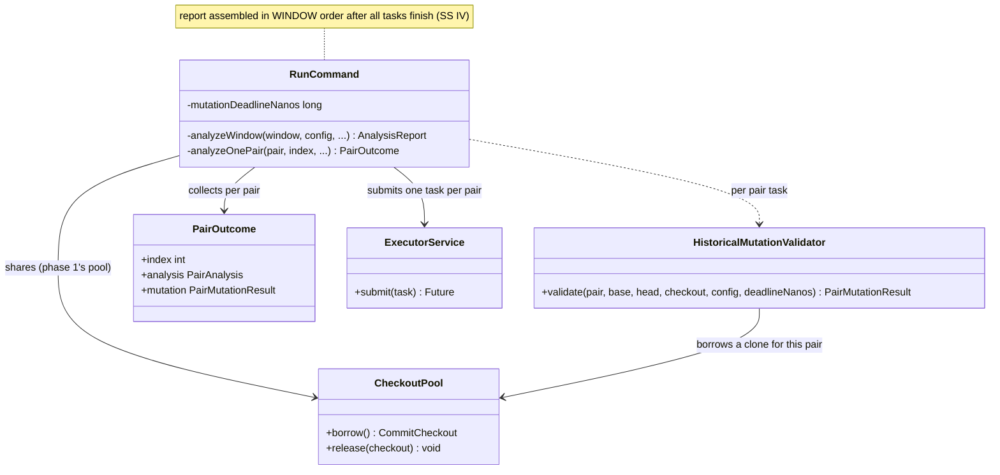
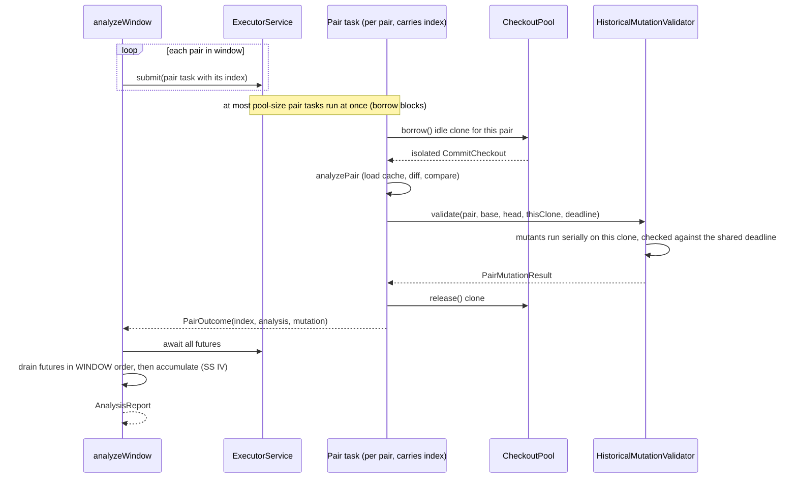

# Design: parallelize phase 2 bounded mutation validation across the idle checkout pool

started: 2026-08-03

## Problem

Phase 1 (`buildAllCommits`) already saturates cores: it builds every commit the window needs
concurrently across a `CheckoutPool` of isolated clones. Phase 2 (`analyzeWindow`) then runs
**serially** over one borrowed clone. The cheap part (load-from-cache, diff, compare) does not
matter, but bounded **mutation validation** does: per pair, `HistoricalMutationValidator.validate()`
runs N full `-pl/-am/-amd` Maven builds one after another, on a single checkout, while the other
`--build-concurrency - 1` clones sit completely idle. A single heavy `-amd` pair took ~50 min alone.

The idle fleet is the opportunity: run several pairs' analysis + mutation validation concurrently,
each pair task borrowing its own clone from the same pool phase 1 used.

## Class diagram

## Sequence: pairs fanned out across the idle pool

## Key decisions

- **Fan out across pairs, not within a pair.** The unit of parallel work is one whole pair
  (analysis + its serial mutant loop). `analyzeWindow` submits one task per pair to the executor
  phase 1 already built; the `CheckoutPool` is the throttle (borrow blocks past pool size). This
  fills cores even when pairs have a single mutant, at the cost of making `analyzeWindow`'s shared
  state concurrent — addressed by the ordered-drain below.

- **Each pair task borrows its own clone (SS VII).** Concurrent pairs must never share a working
  tree — each checks out its own head and its mutants wipe `target/`. One clone per in-flight pair,
  released when the pair finishes; the isolation phase 1 relies on carries straight over.

- **Report assembled in window order, after all tasks finish (SS IV).** Pairs complete out of
  order, so tasks return a `PairOutcome(index, ...)` rather than appending to shared lists mid-run.
  `analyzeWindow` drains the futures in submission (window) order and only then accumulates misses,
  decisions, coverage, and experiments — so the report is byte-identical regardless of finish order,
  and no shared list needs locking.

- **`reactorScopeCache` becomes concurrent or per-task.** The per-head-commit scope memo is shared
  across pairs; either a `ConcurrentHashMap` with `computeIfAbsent` or dropped in favor of per-task
  computation. Concurrent map keeps the repeated-head saving without a race.

- **Shared collaborators are stateless (SS III).** `GroundTruthResolver` / `MavenBuildRunner` /
  `SurefireReportParser` hold only config, so one shared instance is safe as long as each
  `resolve()` runs against a distinct `projectDir` — guaranteed by per-pair clones.

- **The deadline stays a single shared instant.** `deadlineNanos` is read-only; each pair's mutant
  loop checks `System.nanoTime() >= deadline` before each build, so the global budget still bounds
  the whole phase without per-task budget bookkeeping.

## Phase-2 mutation-result caching (included in this feature)

Phase 1 already resumes from a crash via the build cache; phase 2's expensive part — the per-mutant
`-pl/-am/-amd` Maven builds — now caches the same way via **`MutationCache`**, a structural twin of
`BuildCache` (disk-backed, atomic temp-file-then-move, corrupt-reads-as-miss, living beside the
report at `<report>.blastradius-mutation-cache/`). `validate()` checks it before each mutant: a hit
is served for free (no build, no deadline charge), a miss builds then stores. This gives phase 2
both crash-resume (skip mutants already completed) and heap-bounding (each `MutationExperiment` is
written rather than held for the whole window), exactly as phase 1 does.

Key decisions:

- **Key on the mutant's identity, not the bounding config.** The entry is keyed by
  `sha256(base, head, sourcePath, offset, operator, original, replacement)`. A mutant's outcome is
  deterministic given those seven fields — `analyzeMutant` never reads `MutationValidationConfig`.
  `--max-mutations-per-pair` and the class filter change *which* candidates are generated, not any
  one's result, so keeping them out of the key lets a re-run with a *wider* bound reuse every mutant
  a narrower run completed (§IV: same inputs → same result).

- **Cache only compilable outcomes.** `MutationCache.store` rejects `UNBUILDABLE` (mirrors
  `BuildCache` refusing failed builds): unbuildable mutants recompile in seconds and could reflect a
  transient interruption that, cached, would poison every resume (§III).

- **Skip-and-continue past the deadline.** Because a cache hit is free, the deadline loop no longer
  breaks at the first post-deadline mutant — it continues scanning so later cached hits are still
  served; only uncached mutants that need a build are counted in `timeLimitSkipped`.

This was originally scoped as a separate follow-up feature but was folded into this one at the
developer's request so the parallelization and its resume story ship as a single change.
