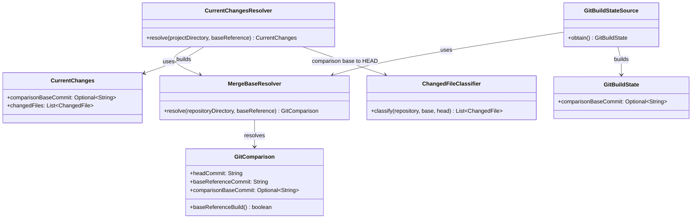
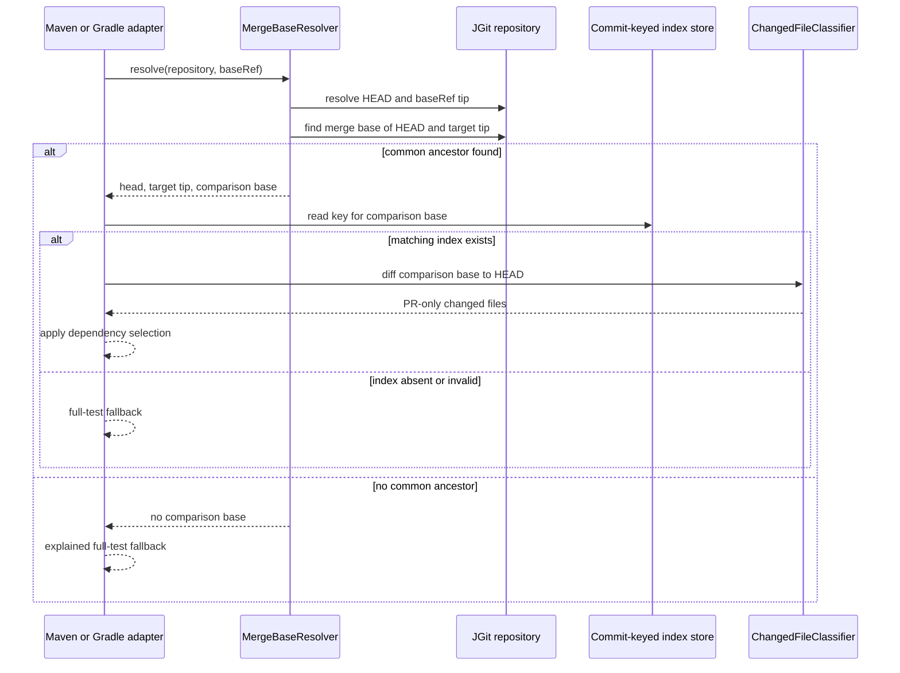

# Design: PR merge-base-aware diffing (#28)

started: 2026-07-21

## Intent

Compare a PR build with its Git merge base against the configured target ref, rather than
with the target's current tip. This excludes changes that have landed on the target since the
branch diverged while retaining the existing full-test fallback when Git cannot establish a
safe comparison point.

## Class diagram

`MergeBaseResolver` belongs in core because Maven and Gradle need the same Git rule. The
adapters keep their existing models, but carry the comparison base separately from the configured
ref's resolved tip: a base-ref build is still exactly `HEAD == baseReferenceCommit` and remains
the only automatic `TRACK` trigger.

## Sequence: SELECT on a PR branch

## Key decisions

- Use JGit's graph-aware merge-base calculation once in shared core, rather than a two-tree
  diff from the moving `baseRef` tip. A target branch may advance after a PR branches; diffing
  that new tip against `HEAD` wrongly includes the target's own work.
- Key SELECT's index lookup and changed-file diff to the merge base. The stored index then
  describes the exact code snapshot from which the PR's changes are measured.
- Preserve `HEAD == resolved baseRef` as the `TRACK` rule. A merge base equal to `HEAD` on a
  branch is not evidence that the branch is the target build.
- Treat unrelated histories or a missing merge base as a named safe fallback, not an error or a
  guessed comparison. This protects selection correctness through unusual rebases or force-pushes.

## Validation

- Core graph fixtures cover a diverged target branch, a merge commit, a rebased branch, and no
  common ancestor.
- Maven and Gradle adapter tests prove they propagate the comparison base to both the diff and
  commit-keyed lookup.
- End-to-end fixtures confirm a target-only change is not selected by a PR build, while a PR
  change still is.
