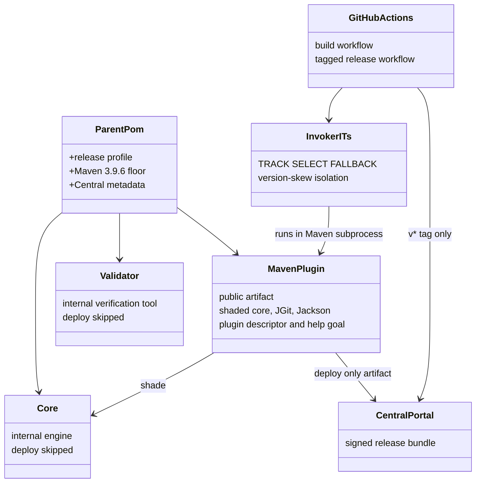
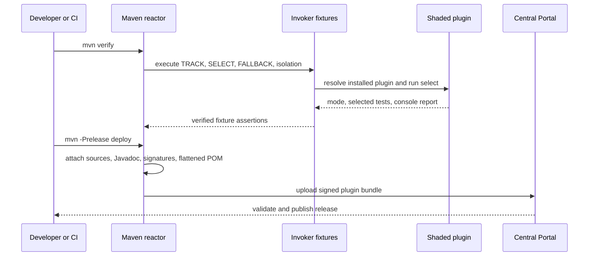

# Design: prepare the 0.1.0 Maven Central release

started: 2026-07-19

## Release shape

Only the Maven plugin is a public artifact. The core engine is embedded into it, while the
validator remains an internal verification tool. The parent centralizes release controls so the
same release profile produces sources, Javadoc, signatures, a flattened consumer POM, and a
Central Portal bundle.

## Release flow

## Key decisions

- The plugin shades the internal core, JGit, and Jackson under private package names. This makes
  the published plugin self-contained and keeps a consumer's versions from leaking into the Mojo.
- Release-only work stays in the `release` profile, so local `test`/`verify` remains quick while
  Central receives its required companion artifacts and signatures.
- The Central publishing extension stages reactor artifacts independently of Maven's normal deploy
  skip flag, so its release configuration explicitly excludes the parent, core, and validator;
  only the shaded plugin enters the public bundle.
- The Invoker executes Maven fixture projects rather than only testing Mojo classes. That is the
  closest repeatable check of the installed plugin's actual lifecycle behavior.
- CI imports its dedicated private signing key and passphrase from encrypted GPG secrets while the
  public fingerprint is distributed through a supported keyserver. Namespace claiming, secret
  creation, tag creation, and observing the completed Central deployment remain account-authorized
  operations.
