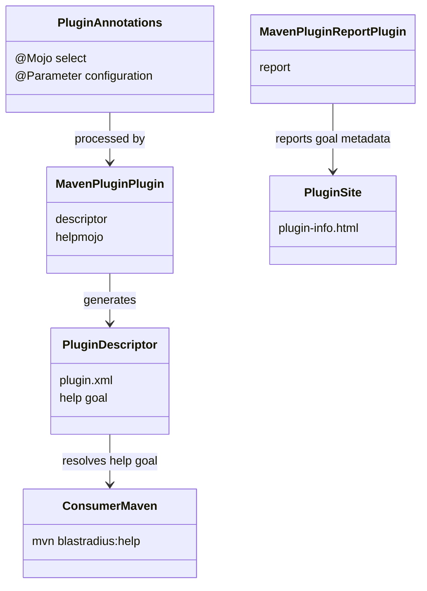
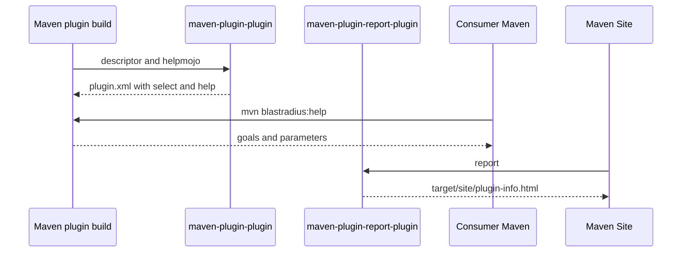

# Design: publish generated Maven plugin goal documentation

started: 2026-07-20

## Documentation shape

## Documentation flow

## Key decision

Keep descriptor and `helpmojo` generation in the plugin build, while using the reporting lifecycle
for `plugin-info.html`. This exposes help to consumers and produces the site on demand without
making normal `verify` builds pay for site generation.
