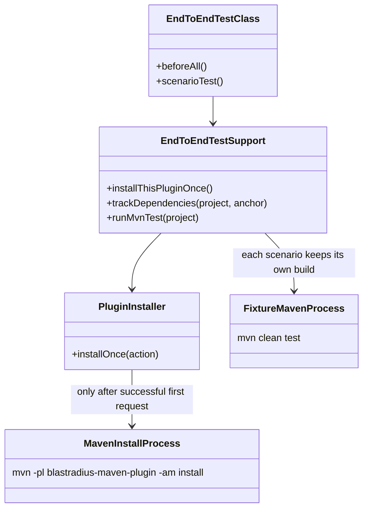
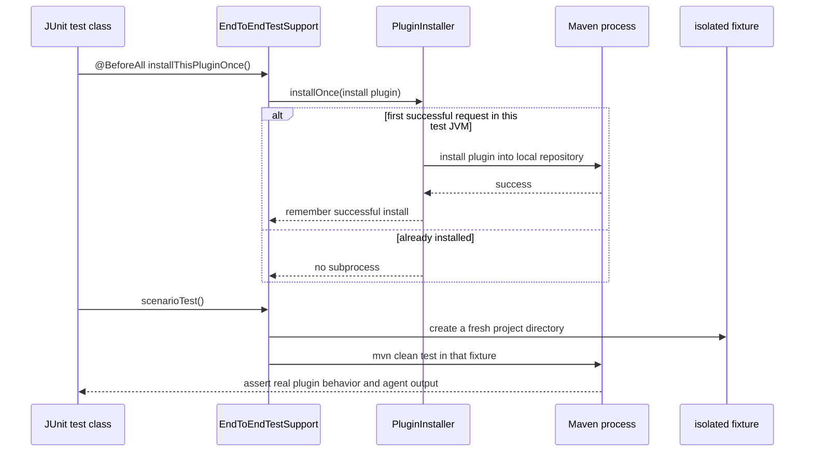

# Design: Reduce Maven plugin integration-test runtime (#75)

started: 2026-07-21

## Performance baseline

On 2026-07-21, a warm local run of `mvn -pl blastradius-maven-plugin -am test` completed in
1m 22.45s. The Maven-plugin module took 1m 15s for 51 tests. The result includes a full,
real fixture build for every end-to-end scenario and repeated setup installs of this plugin.

After caching the successful setup install, the same command completed in 51.43s (53 tests),
a 37.6% end-to-end reduction. The Maven-plugin module took 45.08s. Both measurements retain
real fixture builds, `clean`, TRACK, SELECT, fallback, and agent-produced-index coverage.

## Class diagram

## Sequence: run an end-to-end scenario

## Decision

Cache only the successful plugin-install setup within the Surefire JVM. Keep every scenario's
separate fixture directory, `mvn clean test` invocation, and real agent-backed dependency-index
coverage. Reusing mutable fixture directories, removing `clean`, or parallelizing nested Maven
builds would need separate isolation and determinism evidence and is intentionally out of scope.
