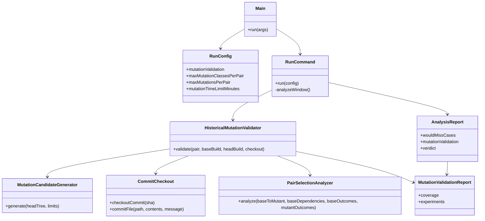
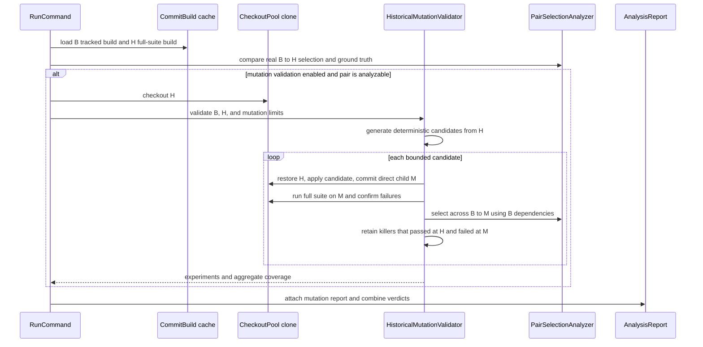

# Design: Refactor mutation validation into historical run replay

started: 2026-08-02

## Purpose

`run` remains the sole validator action. Its normal historical replay is unchanged unless the
operator enables `--mutation-validation`. When enabled, every eligible real sequential pair
`B -> H` receives a bounded set of synthetic mutants made from `H`. Each mutant `M` is a direct
child of `H`, but selection is evaluated across `B -> M`: this preserves the real pair's
dependency baseline and its accumulated change set, then adds one controlled fault at the head.

The full suite at `H` is the mutation baseline. A test counts as a mutation killer only when it
passes at `H` and is confirmed failed at `M`. This excludes failures already introduced by the
real historical change.

## Class diagram

## Sequence: one historical pair with mutation validation

## Contract

- `mutate` and its separate JSON/text report are removed. `run` gains
  `--mutation-validation`, `--max-mutation-classes-per-pair`,
  `--max-mutations-per-pair`, and `--mutation-time-limit-minutes`.
- Mutation validation is opt-in. Bounds are explicit: class and mutation limits apply to each
  historical pair, while the time limit bounds the complete run.
- Every synthetic mutant is isolated in a validator checkout. The target repository working tree
  is never altered.
- Unbuildable mutants, flaky failures, and tests already failing at `H` remain visible but do not
  create soundness failures. A confirmed killer that Blastradius did not select makes both the
  mutation result and the overall historical run fail.
- The source-of-truth `AnalysisReport` owns a nullable `MutationValidationReport`. It carries the
  full denominator and every experiment tagged with its real `B -> H` pair and synthetic mutant
  SHA.

## Design choice to confirm

The recommended selection edge is `B -> M`, where `M` is `H` plus one mutation. It tests the
same dependency baseline and historical change context as the real `B -> H` pair. The rejected
alternative is selecting only across `H -> M`; that would rebaseline at every head and turn this
into many standalone diagnostics, no longer validating the replayed historical pair.
