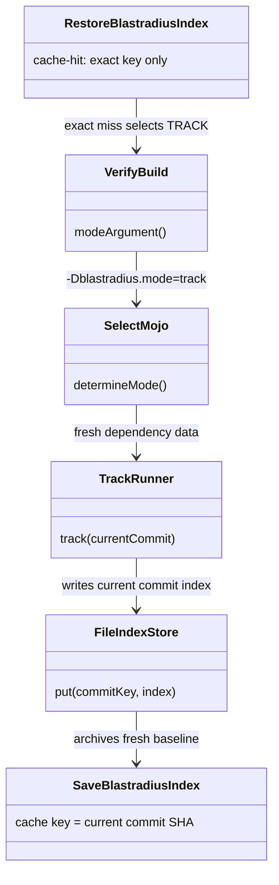
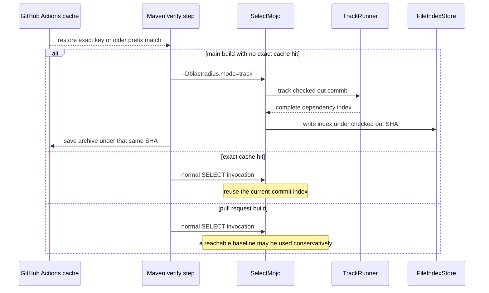

# Design: Refresh the main CI dependency index after conservative fallback and prevent stale index promotion

started: 2026-07-26

## Class diagram

## Sequence: refresh a main baseline after an exact-cache miss

## Design rationale

An Actions cache is an archive, not proof of which commit produced its contents. A prefix
restore is allowed to supply a usable older baseline for a pull request, but a main build that
does not restore its exact commit key must refresh that baseline before it saves an archive under
the current SHA. The workflow therefore explicitly requests the plugin's existing `TRACK` mode
only for a main build with an exact-cache miss. `TRACK` records dependencies for the checked-out
commit and writes an index keyed by that commit. A rerun with an exact cache hit keeps the normal
selection path and avoids unnecessary tracking.

This keeps the index payload and cache key aligned. It avoids a new engine abstraction and relies
on the existing explicit mode switch, `TrackRunner`, and commit-keyed `FileIndexStore`.
