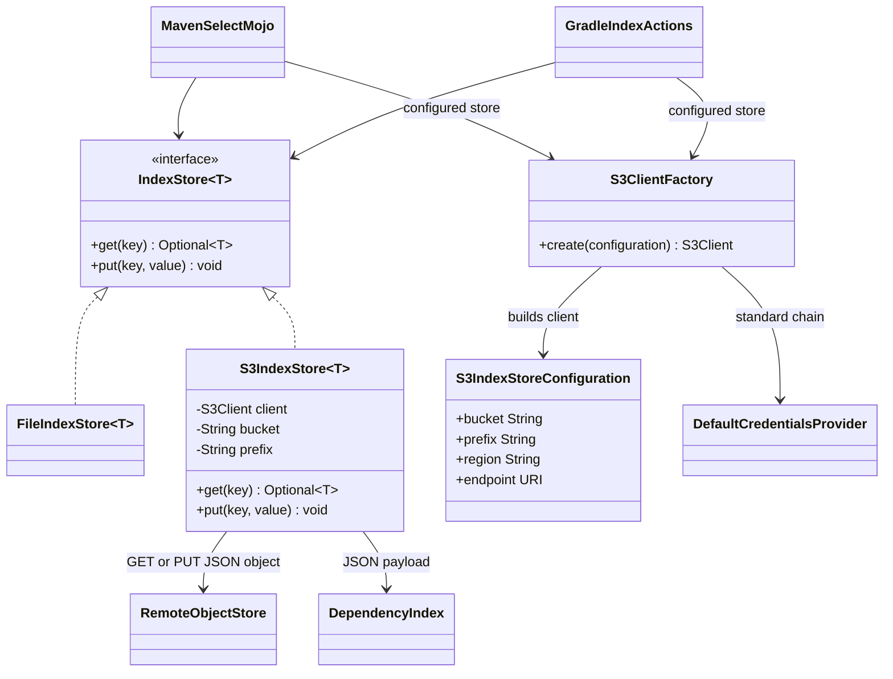
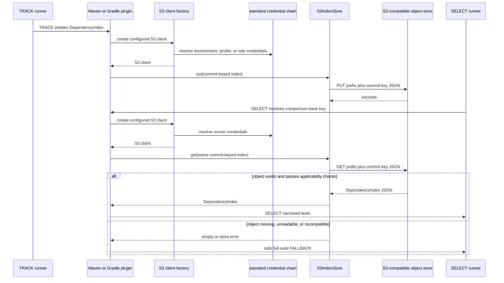

# Design: Remote index backend with S3-compatible object storage for issue #27

<!--
FluencyLoop Stage 2 — one design.md per feature, committed alongside it.
Defaults: a class diagram and a sequence diagram (the two first-class Mermaid types that
pay their way most often). Add an interaction/flow view only when it earns its place.
Keep the Mermaid blocks TOP-LEVEL (not nested in another code fence) so GitHub renders them.
Delete this comment once the diagrams are real.
-->

started: 2026-07-25

## Class diagram

## Sequence: TRACK on one runner, SELECT on another

## Design

- Keep `IndexStore<T>` as the common contract. Add an AWS SDK v2-backed `S3IndexStore<T>` in a
  dedicated module, so the core tracking agent stays independent of cloud dependencies and the
  build plugins opt into S3 only when configured.
- Configure `bucket`, optional `prefix`, `region`, and optional endpoint through both the Maven
  plugin and Gradle extension. An endpoint selects an S3-compatible provider such as MinIO; the
  region remains required because AWS Signature V4 uses it when signing requests.
- Build clients with the SDK's default credential-provider chain. Credentials are deliberately
  absent from plugin configuration: CI can supply environment or workload-role credentials and
  local users can use their shared AWS profile.
- Preserve the current commit-keyed object name. A base-ref TRACK writes the object and a PR
  runner SELECT reads the same key, which enables sharing without a runner-local workspace.
- Preserve safety semantics: a missing object maps to no index, and transport, authentication,
  JSON, or applicability failures leave tests unfiltered. Remote storage must never create an
  empty selection or conceal an error as a valid index.

## Constitution check

- **§I - TDD:** start with failing unit tests for object-key construction, missing-object handling,
  JSON round trips, and configuration validation before implementation. Add plugin configuration
  tests and a two-client integration test using an S3-compatible test service.
- **§II - simplicity:** add one concrete backend behind the existing two-method `IndexStore`
  interface. Do not introduce a generic cloud-provider abstraction, retries, replication, or
  credential configuration in this feature.
- **§III - safety:** an unavailable, unauthorized, corrupt, or incompatible remote index keeps
  the existing full-suite fallback. Credentials never appear in configuration, reports, or logs.
- **§IV - deterministic core:** commit-key construction and index validation remain local and
  deterministic. Only the configured storage transport is remote.
- **§VI - current foundations:** use the maintained AWS SDK for Java v2 and its documented
  default credential chain and endpoint configuration.

## Validation

1. Unit tests prove the store maps a missing S3 object to empty, serializes and deserializes the
   existing JSON format, applies a normalized prefix, and surfaces other S3 failures for the
   callers' safe fallback.
2. Maven and Gradle tests prove configuration creates the remote store only when requested and
   preserves the local store by default.
3. An integration test runs TRACK using one plugin client and SELECT using a fresh client against
   an S3-compatible service, proving the index is shared across runners.
