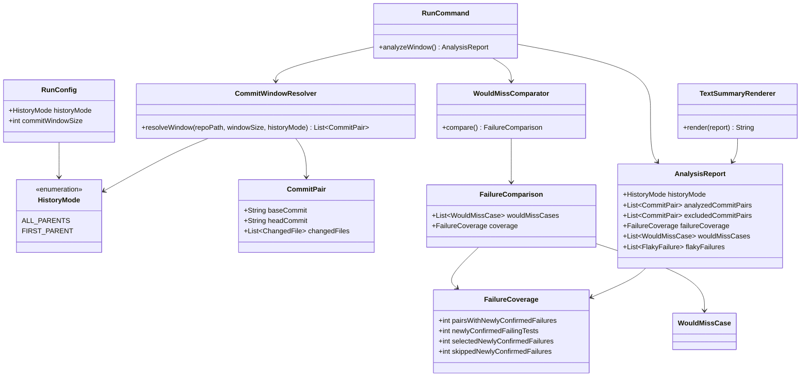
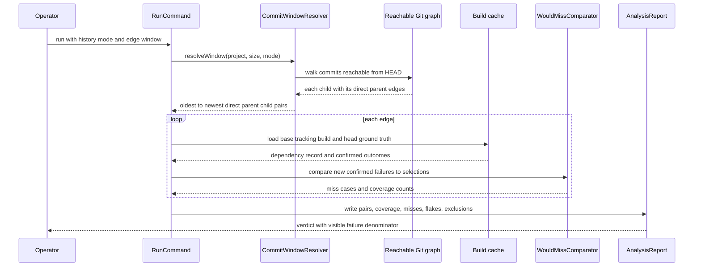

# Design: Replay real parent-child history edges and report failure-bearing coverage

FluencyLoop Stage 2 for [issue #186](https://github.com/baokhang83/blastradius/issues/186).

## Class diagram

## Sequence: resolve, replay, and account for a real edge

## Design

### Direct graph edges, not traversal adjacency

`CommitWindowResolver` will keep walking all commits reachable from `HEAD`, including commits
preserved by merged branches. For every encountered child commit, it will emit its direct
parent-to-child edge or edges instead of pairing neighbouring entries in `RevWalk` order.
Every reported pair will therefore satisfy `baseCommit` is a Git parent of `headCommit`.

`HistoryMode.ALL_PARENTS` is the default. It includes an edge from every direct parent of each
reachable child, retaining broad merged-history coverage. `HistoryMode.FIRST_PARENT` is an
explicit narrower mode for operators who want mainline-only replay. The edge window limits the
number of emitted edges, not commits. The resolver returns the selected edges in a
parent-before-child order for intelligible progress output. Duplicate commit builds remain cheap
because `CommitBuildService` already keys and caches builds by commit plus agent attachment.

Rejected: continue pairing adjacent `RevWalk` entries. That is compact but can compare unrelated
commits in non-linear history, so it does not simulate an actual change.

Rejected: first-parent-only as the sole mode. It is easy to explain but discards useful
failure-bearing commits that survive in merged branch history, contrary to the issue goal.

### Failure-bearing coverage is a first-class report result

`WouldMissComparator` already distinguishes a newly confirmed head failure from a failure that
was already confirmed on the base. It will return a `FailureComparison` rather than only a list
of misses. The comparison produces both the existing individual `WouldMissCase` records and a
`FailureCoverage` aggregate:

- pairs with one or more newly confirmed failures
- newly confirmed failing tests
- newly confirmed failures selected
- newly confirmed failures skipped

The skipped count must equal the number of would-miss cases. A test that is flaky on confirmation
does not enter this denominator, and a pair whose build fails before test reports exist remains
excluded because test selection could not have influenced that failure. Exclusions and flaky
failures remain visible in the JSON report and become explicit counts in the text summary.

Rejected: infer the denominator from the would-miss list. A zero-sized miss list cannot say
whether selection caught every observed failure or whether no new confirmed failure occurred.

### Report compatibility and evidence wording

`AnalysisReport` will include the history mode and `FailureCoverage`. The JSON contract test will
lock down the new fields, and the text renderer will print the coverage block before individual
would-miss cases. README wording will describe old adjacency-based analyses as superseded once
the existing projects are rerun with this edge semantics; it must not present a zero miss count
without its observed-failure denominator.

## Constitution check

- **I. Test-Driven Development:** resolver and comparator/report tests are written red before
  production changes, including a merge graph that proves every edge is a direct parent edge.
- **II. Clean Code and Simplicity:** the existing resolver, comparator, and report objects gain
  small concrete values instead of a new validation framework.
- **III. Safety Over Speed:** real edges and explicit failure denominators make evidence more
  auditable, while pre-test build failures remain honestly excluded.
- **IV. Deterministic Core Before ML:** graph traversal, edge selection, and counting are fully
  deterministic.
- **V. Explainability:** report consumers can see the replay mode, denominator, misses, flakes,
  and exclusions rather than infer them.
