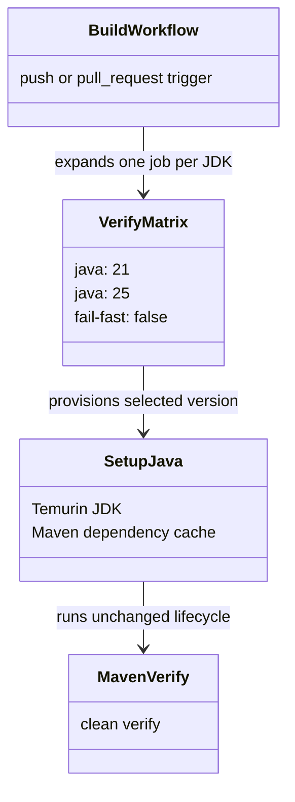
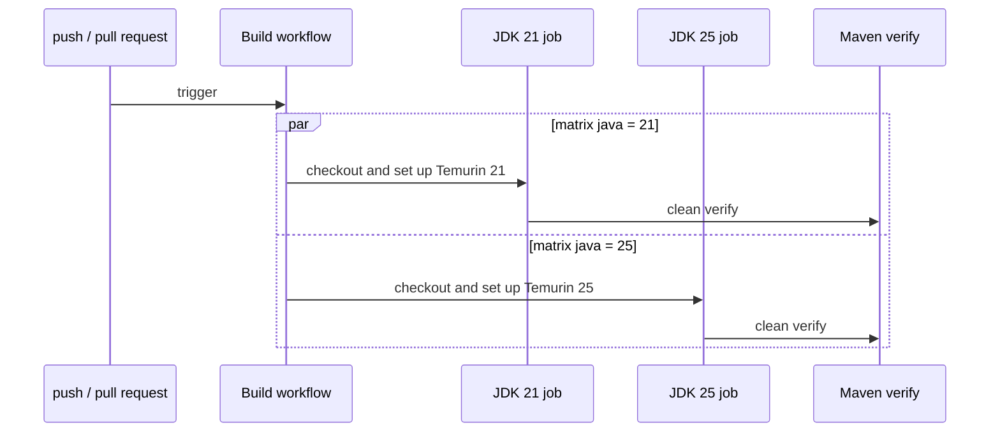

# Design: Run CI on JDK 21 and 25

<!--
FluencyLoop Stage 2 — one design.md per feature, committed alongside it.
Defaults: a class diagram and a sequence diagram (the two first-class Mermaid types that
pay their way most often). Add an interaction/flow view only when it earns its place.
Keep the Mermaid blocks TOP-LEVEL (not nested in another code fence) so GitHub renders them.
Delete this comment once the diagrams are real.
-->

started: 2026-07-20

## Class diagram

## Sequence: CI verification matrix

## Compatibility boundary

- The build workflow, rather than the release workflow, is the compatibility gate: every pull
  request and every push to `main` proves the full Maven reactor and invoker tests on both
  supported LTS JDKs. Feature-branch pushes rely on the pull-request run, avoiding duplicate work.
- A single matrix job keeps checkout, Maven setup, caching, and verification identical across
  JDKs. Duplicating two near-identical jobs was rejected because the steps could drift.
- Matrix failures do not cancel their sibling job, so a JDK 21 regression cannot hide the JDK 25
  result, or vice versa.

## Validation

1. Confirm the rendered workflow has one job for JDK 21 and one for JDK 25.
2. Confirm both entries run the unchanged `mvn -B --no-transfer-progress clean verify` command.
3. Merge only after both GitHub Actions matrix entries pass.
