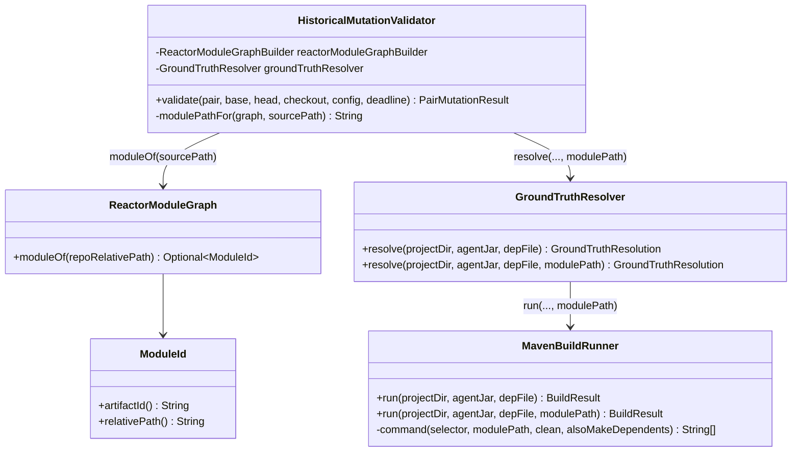
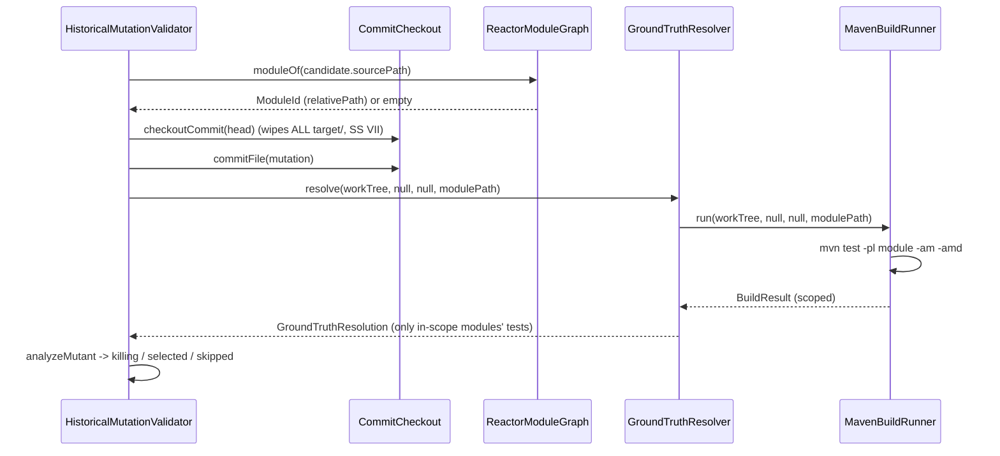

# Design: Scope each synthetic mutant build to the mutated module instead of a full clean reactor rebuild

started: 2026-08-02

## Problem

`HistoricalMutationValidator.validate()` runs one full `mvn clean test` across the entire
reactor per synthetic mutant (via `GroundTruthResolver.resolve(tree, null, null)`). For 5
commit pairs x 20 mutations that is up to 100 serial full-reactor rebuilds. A mutant is a
single-token change to one file in one module: the only tests that can change outcome live
in that module or in modules that (transitively) depend on it. Rebuilding and re-testing
every other module is pure waste.

## What must NOT change (soundness, constitution SS III)

One mutant per build. Batching all mutations into one build would widen the `B -> M` diff to
every mutated file, so Blastradius would "correctly select" a killing test merely because it
touched a *co-mutated* file it doesn't actually depend on -- reporting PASS where isolation
reports a would-miss. False PASS is the dangerous direction for a shadow-mode gate, so each
mutant stays isolated.

## The change

Resolve the mutated file's owning module from the reactor graph and scope the mutant build to
`-pl <module> -am -amd`:

- `-pl <module>`   build only the mutated module
- `-am`  (also-make)            + its upstream dependencies, so the module compiles
- `-amd` (also-make-dependents) + every module that depends on it, where a killing test may live

If no module owns the path (root/aggregator pom -- `ReactorModuleGraph.moduleOf` empty), fall
back to the full reactor (unscoped): the sound default, never guess narrower.

`CommitCheckout.checkoutCommit()` already wipes every `target/` before each mutant, so no stale
`TEST-*.xml` can survive to fool `BuildFailureDetector` (SS VII) -- scoping the *build* does not
weaken that guarantee, because the *wipe* stays reactor-wide.

## Class diagram

## Sequence: one mutant, module-scoped build

