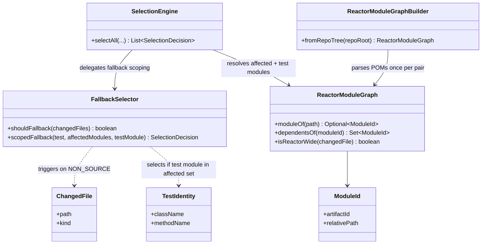
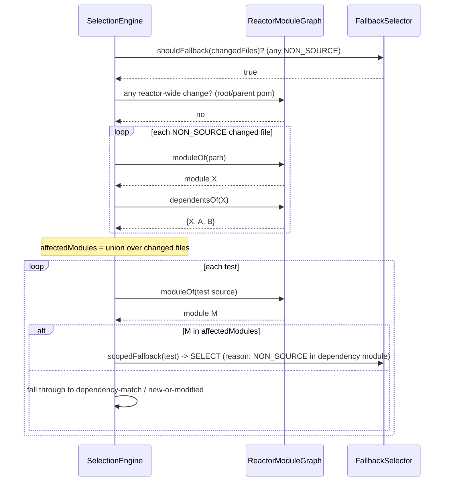

# Design: scope the NON_SOURCE fallback to the changed module + its reactor dependents

started: 2026-07-29

## Motivation

A validator run over apache/shenyu (30 commit pairs) selected 9933 / 27090 test executions
(63.3% skipped) with **zero** dependency-matched selections — every selected test came from
fallback. Breaking it down by pair: 11 of 30 pairs hit the `NON_SOURCE` fallback and selected
the *entire* suite; 19 selected nothing (no changes, inert-only, or Java changes that matched
no test). All the lost savings live in those 11 fallback pairs. And 9 of the 11 touched only
1&ndash;4 top-level modules &mdash; only **one** pair (root `pom.xml` + 292 files across 22
modules) was genuinely reactor-wide. The fallback is needlessly whole-reactor.

Today `FallbackSelector.shouldFallback` is a single global boolean: *any* `NON_SOURCE` file
anywhere in the diff selects *every* test (`FallbackSelector.java:14-15`,
`SelectionEngine.java:42-44`). This feature makes it module-aware: a `NON_SOURCE` change in
module X selects tests in X and every module that (transitively) depends on X, while a
root/parent-POM or reactor-root config change still selects everything.

## The load-bearing constraint

Selection runs in `blastradius-core`, shared by both the Maven plugin **and** the shadow-mode
validator. The validator has **no live `MavenProject`** &mdash; it works from a git diff plus
tracked dependencies. The selection layer knows a test only as a `TestIdentity`
(class + method); neither it nor the tracked dependency data records a module. So module
attribution and the reactor graph must be derived from the **git tree** (POM files + source
paths), computed once per commit pair and passed into the engine &mdash; never read from Maven's
runtime reactor, or the validator (the very tool that measures soundness) couldn't use it.

## Soundness (Constitution &sect;III)

The fallback exists because a `NON_SOURCE` change (pom, yaml, sql, resource) can affect a test
in a way class-load tracking cannot see. Narrowing it must not drop a test that change could
break. The reactor dependency graph is the conservative unit: if module X's build inputs
changed, only X and modules that depend on X could be affected &mdash; a module that does *not*
depend on X cannot see X's classes, resources, or built jar. Two escape hatches keep it safe:

- **Reactor-root / parent-POM change &rarr; whole suite** (unchanged behavior). A file not inside
  any single leaf module, or the parent POM every module inherits, can affect everything.
- **Unresolvable module &rarr; whole suite.** If a changed file can't be attributed to a module,
  or a test's module can't be determined, fall back to selecting it. Never guess narrower.

## Class diagram

## Sequence: a leaf-module resource change scopes fallback

## Open decision (to resolve at the first slice)

**How does a `TestIdentity` (class FQN, no path) map to a module?** The engine is handed
`Set<TestIdentity>`; the reactor graph maps *paths* to modules. Candidate resolutions, all
git-tree-derivable:

1. **Package-root scan** &mdash; scan each module's `src/test/java` once, build `class FQN -> module`.
   Exact, but assumes standard layout.
2. **Record module at tracking time** &mdash; extend the tracked data with each test's module.
   Most robust, but changes the on-disk index format (versioning cost).
3. **Reuse the existing per-test code-source path** the agent already sees at load time.

Leaning toward (1) for this feature (no format change, works for the validator's historical
replay); (2) is a possible follow-up if layout assumptions bite.

## What this does *not* fix

Classifier tightening (making more files `INERT`) is a separate, smaller lever and does not
move these numbers &mdash; every one of the 11 fallback pairs also carries a legitimately
`NON_SOURCE` pom/yaml, so it would still fall back. This feature is the actual savings lever.
