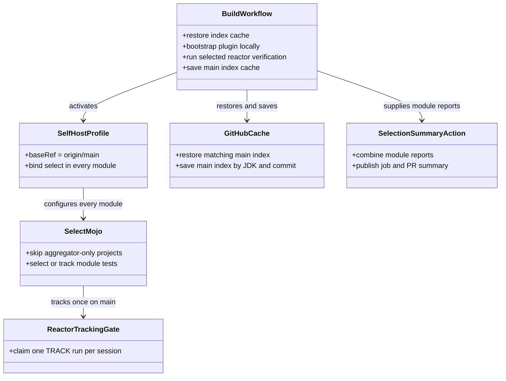
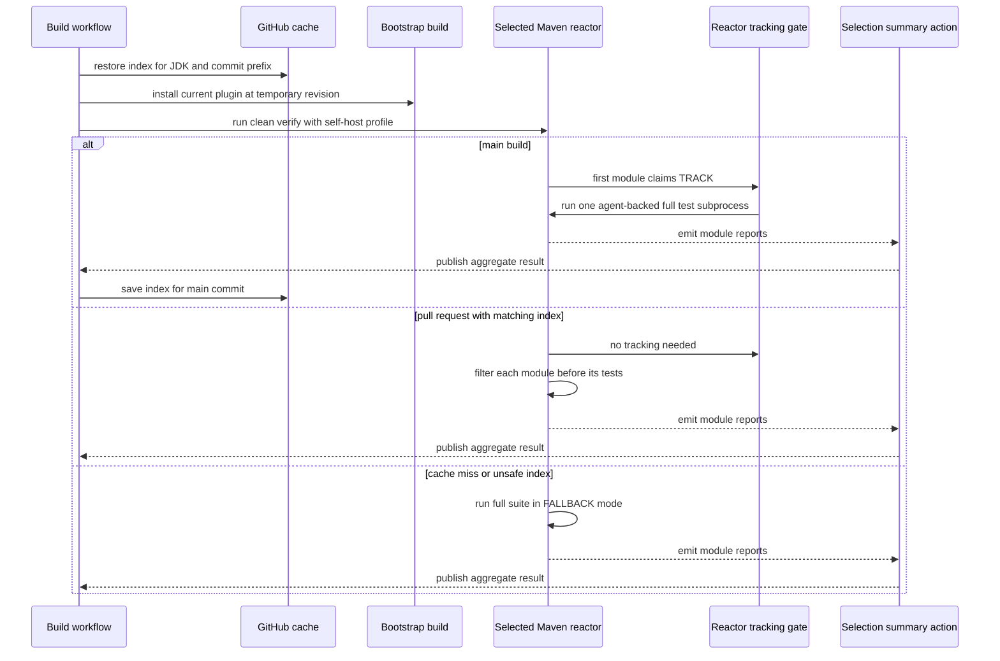

# Design: Self-host Blastradius test selection in CI

started: 2026-07-26

## Class diagram

## Rationale

The CI job bootstraps the plugin built from the current checkout under a temporary
`0.1.0-selfhost` coordinate, then activates an opt-in Maven profile for the real verification
run. The bootstrap step updates only the copied plugin descriptor so Maven accepts that external
coordinate; published project POMs remain at their normal version. The verification reactor also
remains at its normal version, avoiding a cycle with the plugin module being built. This exercises
the code under review instead of a previously published version.

Selection remains module-local because each module reaches `process-test-classes` only after its
own tests are compiled. A reactor-scoped gate permits one TRACK subprocess on `main`, while every
other module reuses the resulting index.

The root `pom` project is an aggregator, not a test-bearing module, so the selector skips it.
This prevents an empty parent from trying to start JUnit tracking; the first child module claims
the reactor-wide TRACK run instead.

Each module writes its existing local report. The selection-summary action combines the known
module reports after the reactor completes, which keeps feedback aggregation in CI presentation
rather than adding another Maven lifecycle listener.

GitHub Actions restores a JDK-specific index cache before the build and saves a new immutable
snapshot only after a successful `main` run. A missing or invalid snapshot leaves every module in
safe FALLBACK mode.

## Sequence: PR selection against a cached main index

