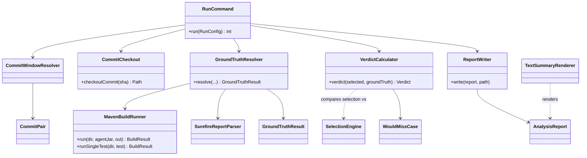
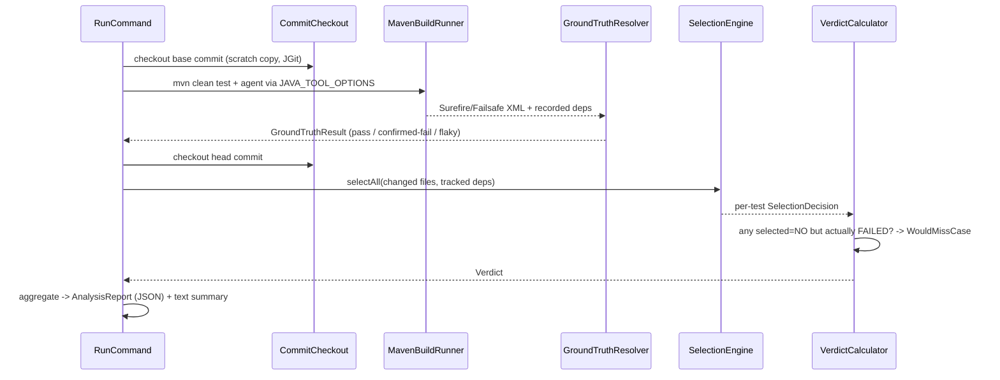

# Design: shadow-mode test-selection validator

started: 2026-07-12

> ✓ **Backfilled, then reviewed.** `blastradius-validator` shipped from
> `specs/001-shadow-mode-validator/` without going through the loop. This design was
> reconstructed from that spec/plan/`research.md`/contracts and the code — not authored live —
> then confirmed by the maintainer on 2026-07-12. See the session journal for the decisions and
> their (now ✓) trust markers.

## What it is

The validator measures whether the selection engine is *sound* by **replaying real project
history**: for each commit pair it runs the target's own build to get ground truth, runs the
engine's selection, and reports any test the engine would have skipped that actually failed
(a "would-miss"). It never mutates the target repo.

## Class diagram

## Sequence: validating one commit pair

