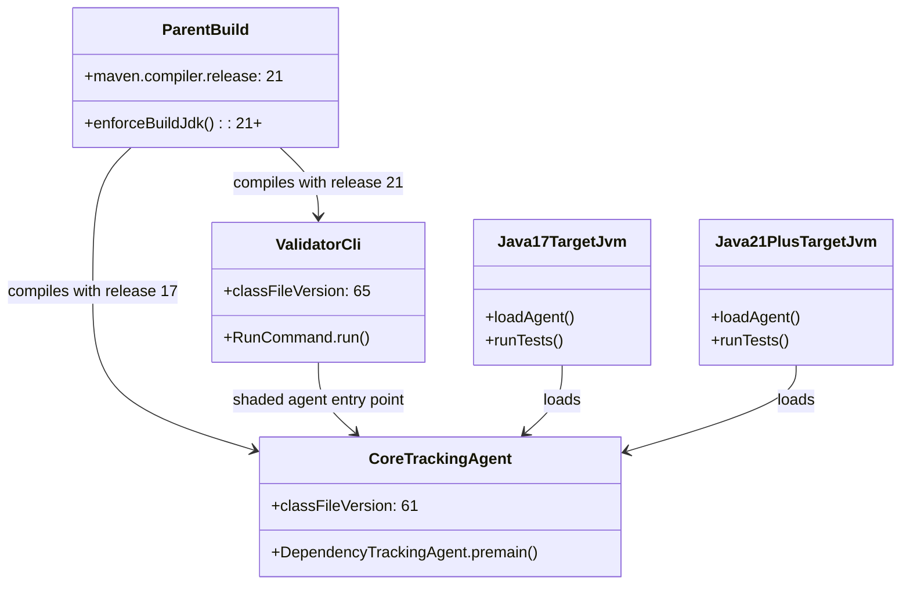
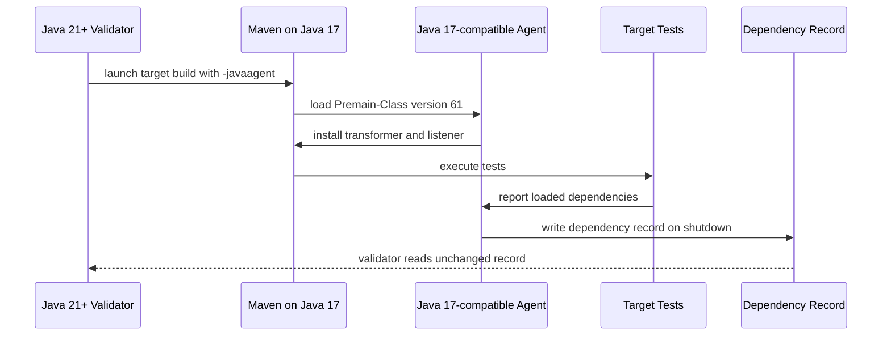

# Design: Support Java 17 target test JVMs with a compatible tracking agent without weakening Java 21+ validator support

started: 2026-07-31

## Problem

The validator is deliberately built for Java 21 and runs correctly on a current JDK. Its
shaded jar is also the `-javaagent` supplied to each target-build JVM. Consequently the agent
entry point is currently class-file version 65 (Java 21). A Maven target such as Gson must run
on Java 17, whose JVM rejects that entry point before any tests start.

The compatibility boundary is the injected agent, not the validator CLI. The validator must
continue to require Java 21 or later, while target JVMs from Java 17 upward must be able to load
the tracking code.

## Approach

Compile `blastradius-core` to Java 17 bytecode while continuing to build the reactor with a
Java-21-or-later JDK. The tracking agent and every project-owned helper it reaches live in core,
so its `Premain-Class` will then be loadable by a Java 17 target JVM. The validator module stays
on the existing Java 21 release and its shaded CLI jar remains the distribution and self-location
mechanism.

This is an intentionally narrow compatibility expansion:

- The agent records and writes exactly the same dependency data. No selection or fallback rule
  changes.
- Java 21 and newer target JVMs, including Shenyu, can load Java 17 bytecode normally.
- The parent enforcer still requires the development/build JDK to be Java 21 or newer. We are
  not lowering Blastradius's own runtime baseline.
- A regression test will assert the tracking-agent entry point is class-file version 61, making
  the Gson failure mode visible without requiring a locally installed Java 17 in CI.

## Constitution check

- **I. Test-driven development:** add the bytecode-compatibility assertion before changing the
  core compiler release.
- **III. Safety over speed:** preserve the agent's data format and behavior; this feature only
  changes which target JVMs can load it.
- **VI. Maintainable, modern foundations:** retain the Java-21-or-later build/validator baseline
  while supporting the still-current Java 17 LTS target runtime.
- **VIII. No avoidable work on the hot path:** compiler targeting changes startup compatibility,
  not the per-class-load transformer path.

## Class diagram

## Sequence: validator tracks a Java 17 target build

## Rejected alternative

Lowering the entire reactor and validator to Java 17 would make the immediate error disappear,
but it would weaken the established Java-21 build/runtime boundary and force unrelated validator
code to give up its current baseline. A separate agent compatibility boundary is smaller,
preserves Shenyu behavior, and makes the reason for supporting Java 17 explicit.
