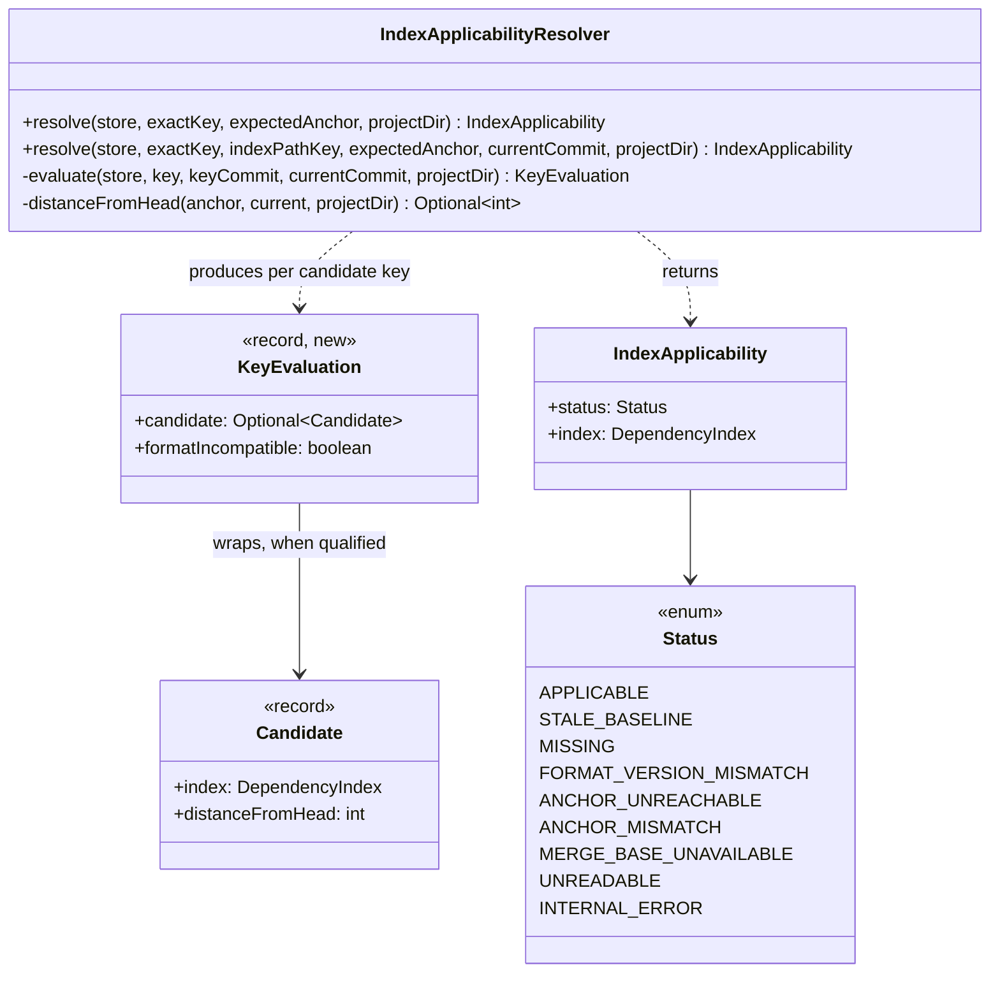
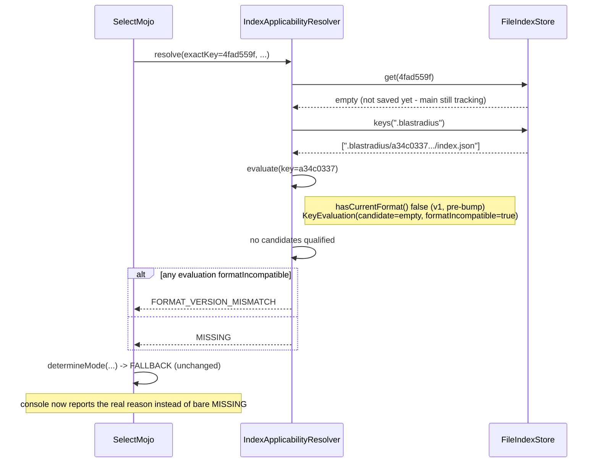

# Design: surface a distinct reason when the stale-baseline fallback's only candidates are format-incompatible, instead of collapsing to bare MISSING

<!--
FluencyLoop Stage 2 — one design.md per feature, committed alongside it.
Defaults: a class diagram and a sequence diagram (the two first-class Mermaid types that
pay their way most often). Add an interaction/flow view only when it earns its place.
Keep the Mermaid blocks TOP-LEVEL (not nested in another code fence) so GitHub renders them.
Delete this comment once the diagrams are real.
-->

started: 2026-07-27

Root cause (PR #121): the ambient-dependency feature bumped `DependencyIndexFormat.CURRENT_VERSION`
1 -> 2. Right after that merge, every previously-cached commit-keyed index on disk is genuinely
`formatVersion: 1` until main's own next TRACK run produces and saves a fresh v2 index. A PR built
from that same main tip, before main's save completes, hits the ancestor-enumeration fallback in
`IndexApplicabilityResolver` with exactly one candidate — the old v1 index — which gets silently
dropped for failing `hasCurrentFormat()`. With zero survivors the resolver falls back to a bare
`IndexApplicability.missing()`, so the console prints "no persisted index found (MISSING)" even
though an index *was* found; it's just the wrong schema version. This is misleading under this
repo's Explainability principle (a distinct fallback reason must be surfaced, not blurred) — and
running the full suite in this case is otherwise the *correct*, safe call (an old-schema index
can't be safely consumed by the current selection engine).

The fix stays inside `IndexApplicabilityResolver`'s enumeration path only: track *why* each
enumerated candidate was rejected, not just whether one qualified, and prefer reporting
`FORMAT_VERSION_MISMATCH` (an existing `IndexApplicability.Status` with its own console message
already) over generic `MISSING` when that's what actually happened. No new status, no behavior
change to which mode runs (`FALLBACK` either way) — only the reported *reason* changes.

## Root cause (PR #122): main can never recover on its own

PR #122 was built from the exact same commit (`4fad559f`, the very merge commit that bumped the
format version) and hit the same bare `MISSING`. Tracing it further: main's own push-triggered CI
run for `4fad559f` forced `TRACK` mode (first build of that commit), but the forked tracking
subprocess (`TrackRunner`, `mvn clean test -DargLine=-javaagent:...`) failed before writing a
fresh index — so nothing new was ever persisted. The workflow still reported overall success (a
warning, not a failure) and still saved a cache entry *labeled* with `4fad559f`'s commit sha, but
its actual contents were whatever stale, pre-bump data had been restored earlier in that same job.
Every PR built from `4fad559f` therefore restored a cache that *looked* like a hit for the right
commit but wasn't — a genuinely different failure from the enumeration-fallback bug above, and a
more serious one: main could not fix this by itself on a rerun, since the same subprocess would
fail identically every time.

The subprocess failed because it re-runs the *whole reactor's* tests with a real `-javaagent`
attached to collect dependency data — including `blastradius-core`'s own
`DependencyTrackingAgentTest`. Two of its tests assumed the static `Instrumentation` seam
(`DependencyTrackingAgent.instrumentation`) was always `null`, true in a plain unit-test run but
false inside `TrackRunner`'s own subprocess. The fix makes those two tests force that seam to
`null` via reflection for their own duration and restore it afterward, so they're correct
regardless of which JVM fork they run in.

## Class diagram

## Sequence: enumeration fallback picks a reason, not just a candidate

