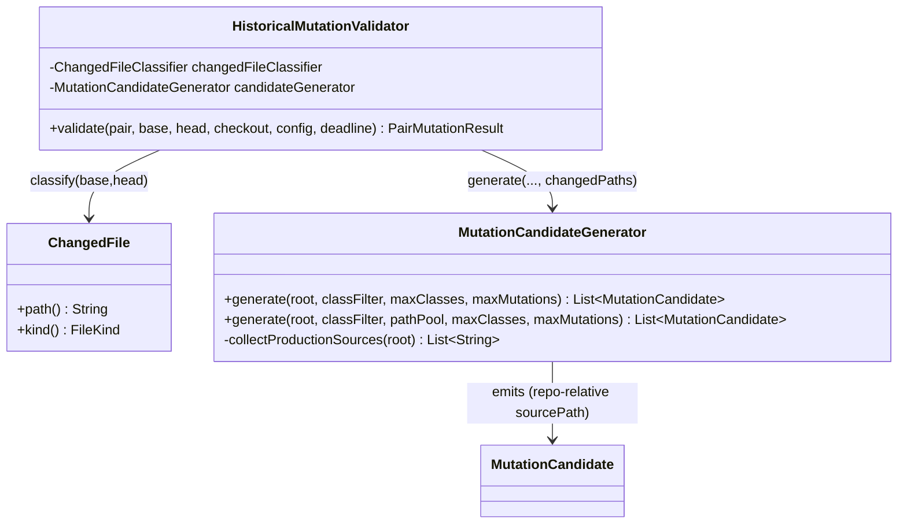
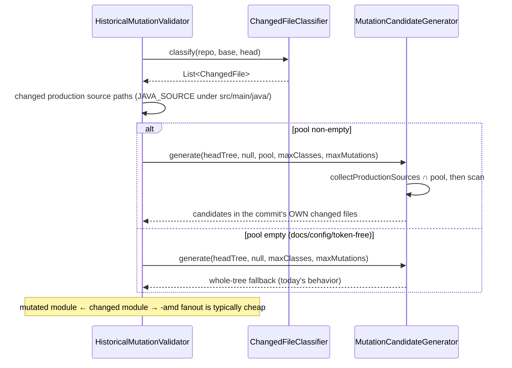

# Design: Target mutation candidates at each pair's changed source files instead of the whole-tree first-yielding class

started: 2026-08-02

## Problem

`HistoricalMutationValidator.validate()` calls
`candidateGenerator.generate(headTree, config.classFilter(), maxClasses, maxMutations)` where
`classFilter` is null by default. So the generator scans the **whole head tree** and mutates the
first *yielding* classes by sorted repo-relative path — code the commit **did not change**. The
pair's own diff is computed later (`changedFileClassifier.classify` inside `analyzeMutant`), but
only to drive selection analysis; it never feeds candidate selection.

Two costs:

- **Relevance.** A real regression lives in the code a commit changed. Mutating an arbitrary
  early-sorted class asks a weaker question than "for the surface this commit touched, does
  selection pick the killing test?"
- **Performance.** Each mutant triggers a scoped `-pl <module> -am -amd` build whose wall-clock is
  set by the mutated module's dependent fanout. The first-yielding class tends to sit in a
  low-level module (large `-amd` fanout → expensive build); real changes cluster in leaf-ish
  modules (small fanout → cheap build). Targeting the diff shifts the mutated module toward the
  cheap end of the distribution.

## The change

Compute the pair's changed files **once** in `validate()` (the classifier is already a field), and
pass the set of changed production **source paths** into the generator as a candidate pool. The
generator mutates only classes whose repo-relative source path is in that pool.

- `ChangedFile.path` is already repo-relative (`shenyu-admin/src/main/java/.../Foo.java`) — the
  exact format `MutationCandidate.sourcePath` uses — so targeting is a plain set-intersection
  against the paths `collectProductionSources` already discovers. No path translation.
- Only `FileKind.JAVA_SOURCE` changed files under a `src/main/java/` segment are eligible (the
  generator only scans Java production sources today; a `.kt` change carries no candidate).

## Fallback (soundness-preserving)

When a pair's diff contains **no mutable production source** (docs/config/test-only commits, or a
changed source with no boolean/operator token), the targeted pool is empty. Fall back to the
current whole-tree scan so the run still exercises *some* mutant rather than silently generating
zero — same behavior as today for those pairs, never a narrower or wrong verdict (§III). The
generator stays a superset: an empty/absent pool means "scan the whole tree" (today's behavior),
a non-empty pool means "restrict to these paths".

## Class diagram

## Sequence: one pair, diff-targeted candidates

