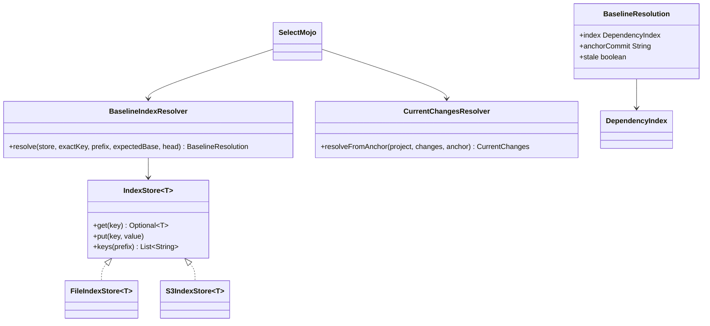
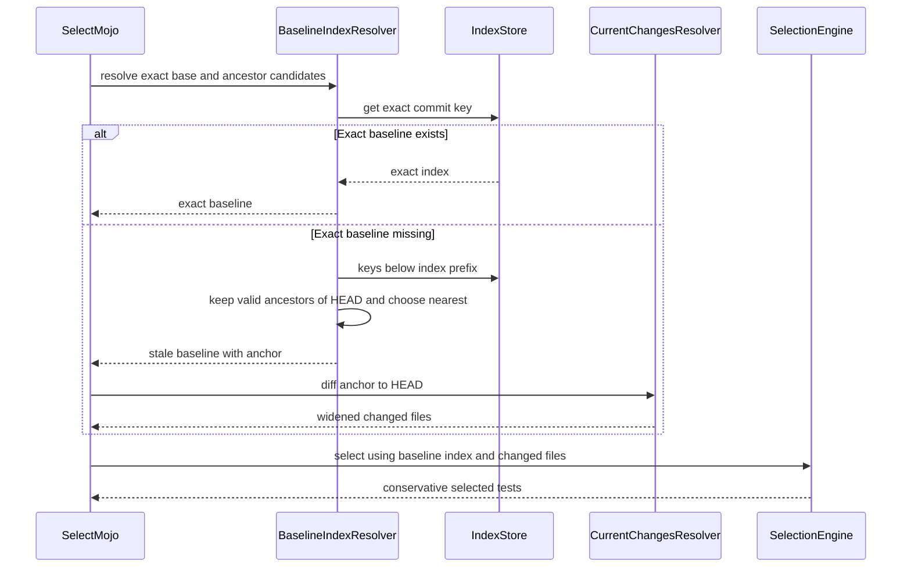

# Design: Use a reachable stale dependency index as a conservative test-selection baseline

started: 2026-07-26

## Class diagram

## Sequence: select with a stale baseline

## Design decision

The exact base-commit index remains preferred. If it is unavailable, the plugin may use
the nearest valid ancestor index only when the anchor is reachable from the tested HEAD.
It then computes changes from that anchor through HEAD, which includes intervening main
changes and the PR change. An unrelated or descendant index is never used; if no ancestor
baseline is available, the build still runs the full suite.

The index-store interface grows a prefix enumeration operation because both supported
backends, filesystem and S3, need to expose the same candidate search. This is a concrete
shared need, rather than a speculative abstraction.
