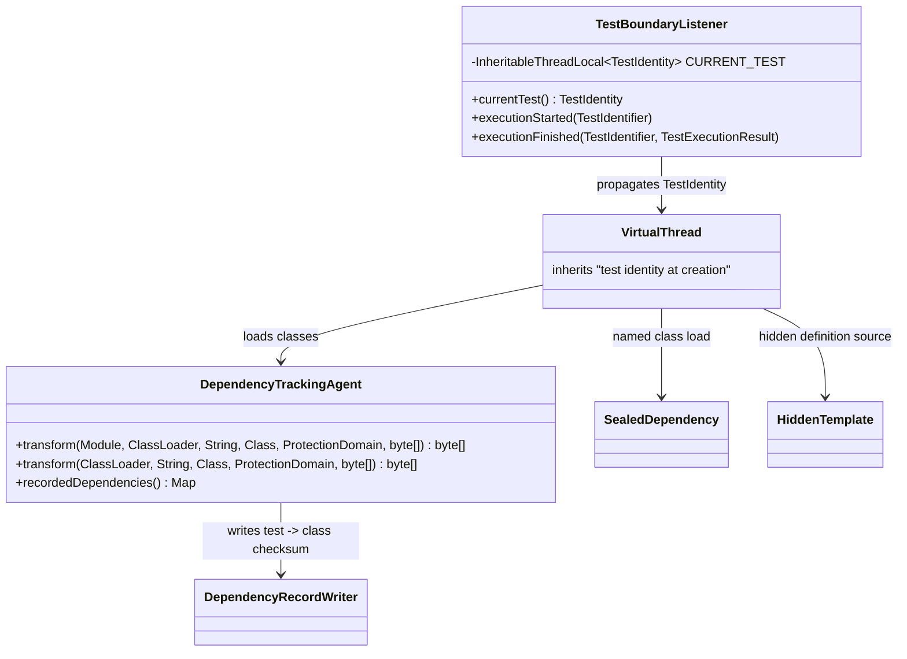
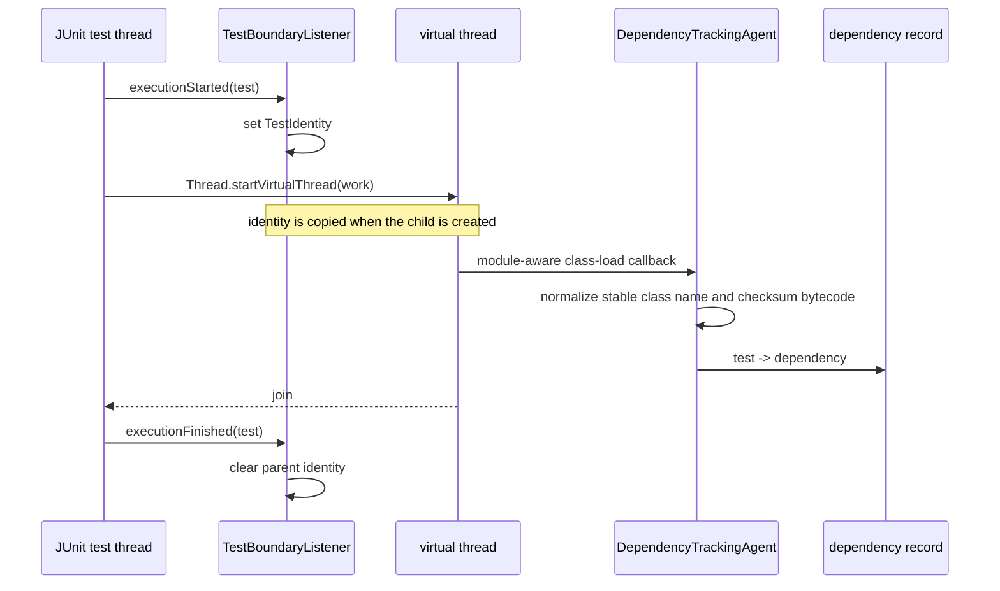

# Design: Verify Java 25 tracking agent support

<!--
FluencyLoop Stage 2 — one design.md per feature, committed alongside it.
Defaults: a class diagram and a sequence diagram (the two first-class Mermaid types that
pay their way most often). Add an interaction/flow view only when it earns its place.
Keep the Mermaid blocks TOP-LEVEL (not nested in another code fence) so GitHub renders them.
Delete this comment once the diagrams are real.
-->

started: 2026-07-20

## Class diagram

## Sequence: JDK 25 class-load attribution

## Compatibility boundaries

- The test uses a sealed production type and `Lookup#defineHiddenClass` from a virtual
  thread on JDK 25. Hidden classes do not enter the class-load transformer, so the
  listener compares the agent's loaded-class list at test start and finish. New hidden
  classes are recorded under their stable source name, never their synthetic runtime
  name, because selection matches changed source-class names.
- The agent remains observation-only and returns `null`; it does not open modules or
  rewrite bytecode. The JDK's module-aware `ClassFileTransformer` entry point is tested
  directly as well as exercised by the subprocess integration test.
- Identity is inherited only when a child thread is created. Tests must still await
  asynchronous work before finishing, otherwise any tracker cannot reliably assign
  late work to a completed test.

## Validation

1. Start a real Maven fixture under the built `-javaagent` on JDK 25.
2. In one JUnit test, load a sealed implementation and define a hidden class from a
   virtual thread; assert both stable source names are recorded for that test.
3. Unit-test the module-bearing transformer callback and preserve the existing
   null-name behavior for unnameable definitions.
4. Run Maven's full verify lifecycle on JDK 25, then Gradle's complete check.
