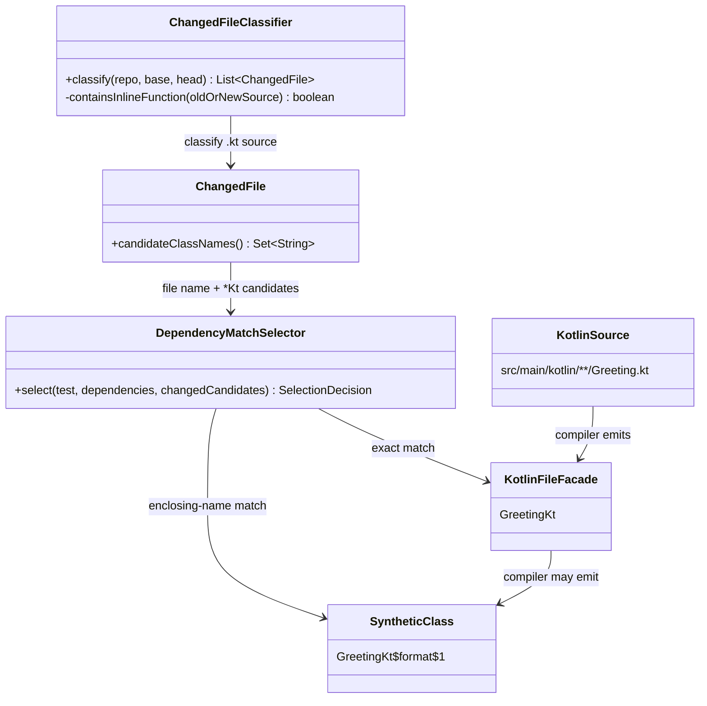
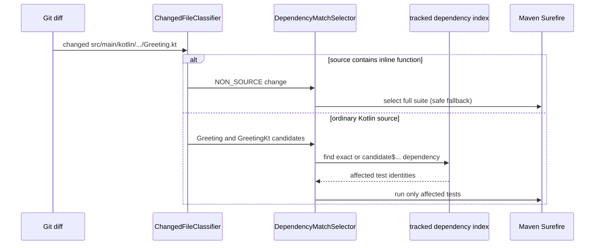

# Design: Verify Kotlin-aware dependency tracking

started: 2026-07-20

## Class diagram

## Sequence: selecting after a Kotlin source change

## Design

- Keep the persisted `ChangedFile` schema and its `JAVA_SOURCE` enum value stable. It now
  means source that can participate in JVM class-level matching, including conventional
  Kotlin sources under `src/main/kotlin` and `src/test/kotlin`.
- A Kotlin path produces two candidates: its ordinary file-name class and Kotlin's
  generated `FileNameKt` file facade. The selector also treats a tracked dependency named
  `candidate$...` as a match, covering compiler-generated nested and lambda classes while
  reporting the stable source candidate as the reason.
- An inline Kotlin function has no dependable class-load boundary: the compiler copies its
  body into each caller. The classifier examines both sides of a changed `.kt` file; if
  either contains `inline fun`, it deliberately marks the file `NON_SOURCE`. The existing
  conservative fallback then runs the full suite rather than risk missing an affected test.
- The Kotlin fixture uses Maven's Kotlin compiler plugin and exercises a real track →
  select build. It proves one affected Kotlin test runs while an independent test is
  skipped. Focused classifier/selector tests cover file facades, `$`-suffixed generated
  classes, and the inline fallback.
- User documentation describes the supported layout and these safety boundaries. In
  particular, custom `@file:JvmName` facades and source files whose JVM declarations do
  not follow their file name remain caveats; teams using them should retain the recommended
  regular full-suite run.

## Validation

1. Make core unit tests fail first for Kotlin source classification, facade/synthetic
   matching, and inline fallback; then make them pass.
2. Run a real Maven fixture with Kotlin sources under the tracking agent, persist its
   index, change the Kotlin production source, and prove `SELECT` runs only the affected
   Kotlin test.
3. Run the complete Maven reactor verification on JDK 21 and 25.
