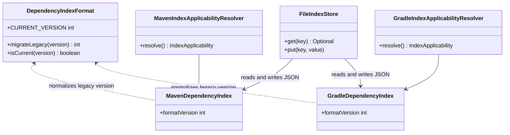
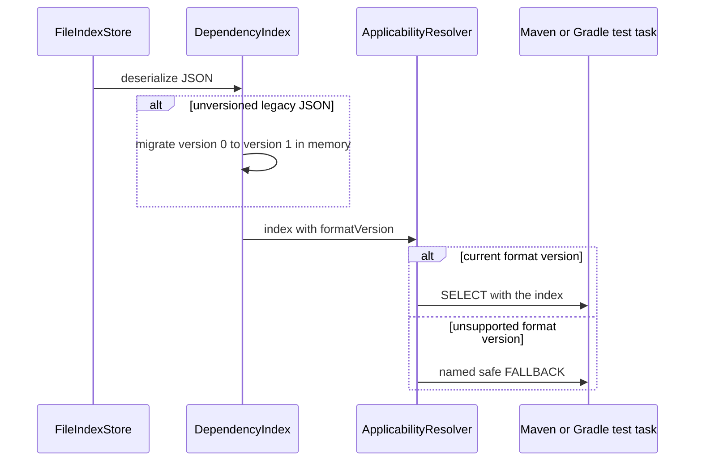

# Design: Version dependency indexes and safely handle incompatibility (#29)

started: 2026-07-21

## Class diagram

## Sequence: read an index safely

## Compatibility cases

| Stored index | Handling |
| --- | --- |
| No `formatVersion` field (the existing schema) | Migrate in memory as known legacy version 0. |
| `formatVersion: 1` | Read and use as the current schema. |
| Any other version | Report a named format mismatch and leave the test task unfiltered. |

## Decision

Keep the format contract in `blastradius-core` because Maven and Gradle persist the same index
schema. Migrate only the known missing-version legacy schema in memory; reject any other version
through each adapter's existing safe-fallback path. A hard failure would needlessly block a build,
while accepting an unfamiliar schema could make an unsound selection.
